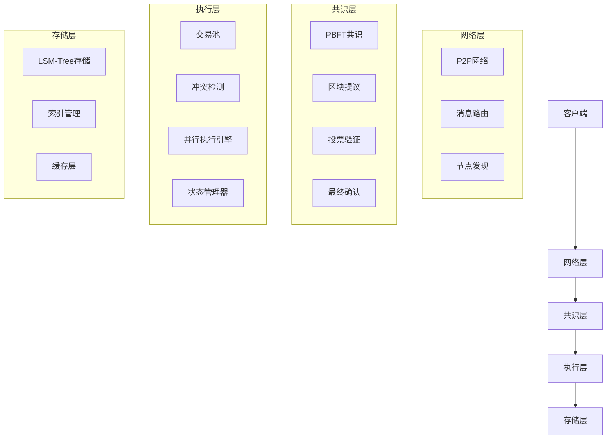

# 高性能区块链系统

一个使用Go语言实现的高性能区块链系统，目标TPS达到10,000+，支持并行执行。

## 项目结构

```
chain/
├── cmd/                    # 命令行工具
│   └── chain/             # 主程序入口
├── chain/                 # 区块链核心模块
├── consensus/             # 共识模块
├── execution/             # 执行引擎
├── network/               # 网络层
├── storage/               # 存储系统
├── types/                 # 基础数据类型
├── config/                # 配置管理
├── docs/                  # 文档
├── config.yaml           # 配置文件
├── Makefile              # 构建脚本
└── README.md             # 项目说明
```

## 核心特性

- **PBFT共识**: 拜占庭容错共识算法
- **并行执行**: 多线程并行处理
- **LSM-Tree存储**: 高性能存储引擎
- **异步状态确认**: 快速状态确认机制

## 技术架构

### 共识层
- **PBFT共识**: 实用拜占庭容错算法
- **快速最终性**: 亚秒级最终性确认
- **容错能力**: 支持1/3恶意节点

### 执行层
- **并行执行**: 乐观并发控制
- **冲突检测**: 基于访问列表的冲突检测
- **状态管理**: 异步状态确认和版本管理

### 存储层
- **存储引擎**: LSM-Tree架构
- **索引管理**: 高效索引和查询优化
- **缓存策略**: 多级缓存，提高访问性能

## 性能目标

### 吞吐量
- **TPS**: 10,000+ 交易/秒

### 延迟
- **区块确认**: < 1秒最终性
- **交易确认**: < 500ms
- **网络延迟**: < 100ms

## 系统架构



## 快速开始

### 环境要求
- Go 1.24+
- 8GB+ RAM
- SSD存储

### 安装和运行

1. **克隆项目**
```bash
git clone https://github.com/govm-net/chain
cd chain
```

2. **安装依赖**
```bash
make deps
```

3. **构建项目**
```bash
make build
```

4. **运行项目**
```bash
make run
```

### 使用Makefile

```bash
# 构建项目
make build

# 运行项目
make run

# 运行测试
make test

# 清理构建文件
make clean

# 格式化代码
make fmt

# 代码检查
make lint
```

## 开发计划

### 第一阶段：核心功能 ✅
- [x] 项目初始化
- [x] 基础架构设计
- [ ] 网络层实现
- [ ] 共识机制实现

### 第二阶段：核心功能 🔄
- [ ] 并行执行引擎
- [ ] 存储系统实现
- [ ] 状态管理
- [ ] 基础API

### 第三阶段：性能优化
- [ ] 性能监控
- [ ] 性能调优
- [ ] 压力测试
- [ ] 优化改进

### 第四阶段：功能完善
- [ ] 智能合约支持
- [ ] 跨链协议
- [ ] 监控管理
- [ ] 文档完善

## 贡献

欢迎贡献代码和想法！请查看 [CONTRIBUTING.md](CONTRIBUTING.md) 了解详情。

## 许可证

MIT License - 详见 [LICENSE](LICENSE) 文件。 