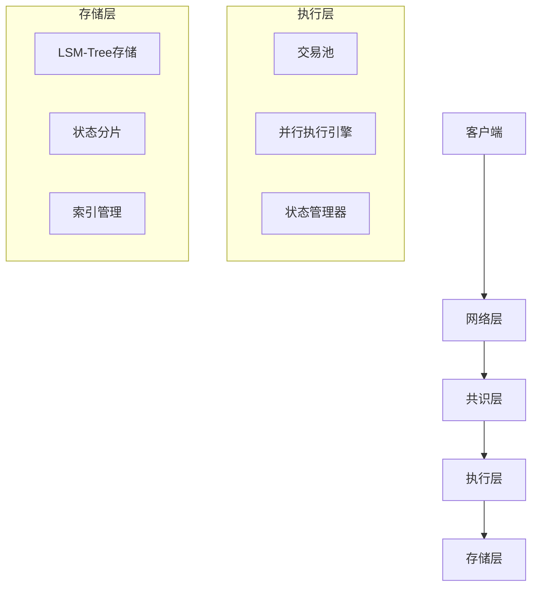

# 高性能区块链项目

一个使用Go语言实现的高性能区块链系统，目标TPS达到10,000+，支持并行执行和状态分片。

## 项目特性

### 🚀 高性能
- **并行执行**: 基于Block-STM的乐观并发控制
- **状态分片**: 水平扩展状态存储
- **LSM-Tree存储**: 高写入性能的存储引擎

### 🔒 安全性
- **拜占庭容错**: 支持恶意节点
- **快速最终性**: 亚秒级交易确认
- **状态一致性**: 强一致性保证

### 📈 可扩展性
- **水平扩展**: 支持1000+节点
- **分片共识**: 多分片并行处理
- **动态调整**: 自适应负载均衡

## 技术架构



## 核心组件

### 并行执行引擎
- 乐观并发控制 (Optimistic Concurrency Control)
- 基于访问列表的冲突检测
- 多线程并行执行
- 版本管理和回滚机制

### 存储系统
- LSM-Tree存储引擎
- 状态分片管理
- 多级缓存系统
- 压缩和索引优化

### 共识机制
- 混合共识 (PoS + BFT)
- 快速最终性
- 分片共识支持

## 性能目标

| 指标 | 目标值 |
|------|--------|
| TPS | 10,000+ |
| 延迟 | < 1秒 |
| 节点数 | 1000+ |
| 存储 | TB级 |

## 开发状态

- [x] 项目初始化
- [x] 架构设计
- [ ] 基础网络层
- [ ] 并行执行引擎
- [ ] LSM-Tree存储
- [ ] 共识机制
- [ ] 性能优化

## 快速开始

### 环境要求
- Go 1.24+
- 8GB+ RAM
- SSD存储

### 安装
```bash
git clone https://github.com/govm-net/chain
cd chain
go mod tidy
go build -o chain ./cmd/chain
```

### 运行
```bash
./chain --config config.yaml
```

## 文档

- [架构设计](docs/architecture.md)
- [并行执行引擎](docs/parallel-execution.md)
- [存储系统设计](docs/storage-design.md)
- [开发任务](todo.md)

## 贡献

欢迎贡献代码和想法！请查看 [CONTRIBUTING.md](CONTRIBUTING.md) 了解详情。

## 许可证

MIT License - 详见 [LICENSE](LICENSE) 文件。 