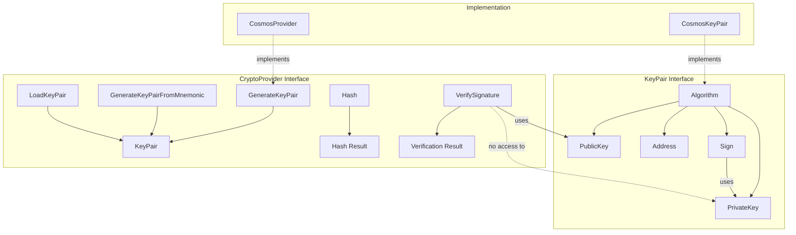
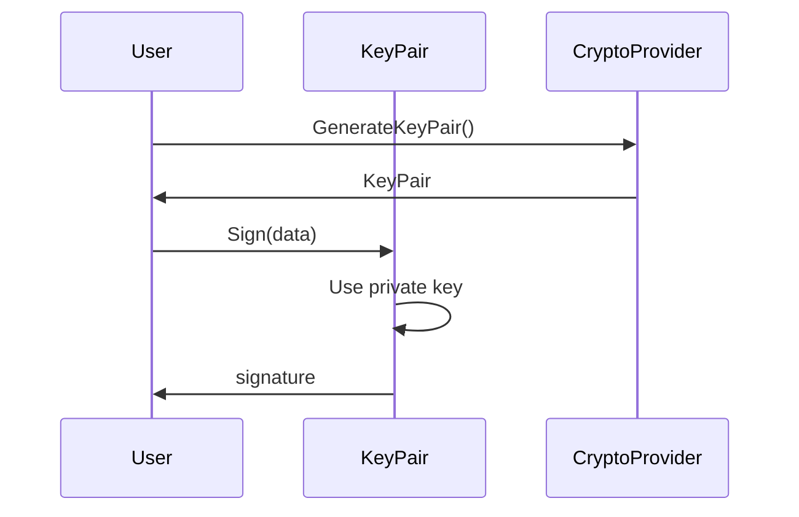
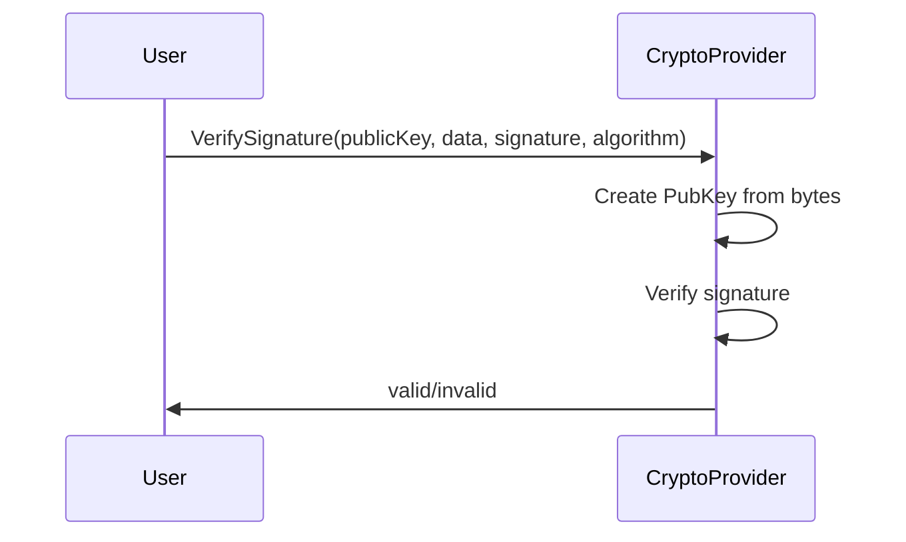

# Crypto Module Design

## 签名与验证分离设计

### 设计原则

1. **职责分离**：签名需要私钥，验证只需要公钥
2. **安全性**：验证时不会暴露私钥
3. **简洁性**：验证逻辑统一在Provider中实现

### 架构图



### 数据流

#### 签名流程



#### 验证流程



### 接口设计

#### KeyPair 接口

```go
type KeyPair interface {
    Algorithm() Algorithm           // 获取算法类型
    PublicKey() []byte             // 获取公钥字节
    PrivateKey() []byte            // 获取私钥字节
    Address() string               // 获取地址
    Sign(data []byte) ([]byte, error) // 签名数据
}
```

#### CryptoProvider 接口

```go
type CryptoProvider interface {
    GenerateKeyPair(algorithm Algorithm) (KeyPair, error)
    GenerateKeyPairFromMnemonic(mnemonic string, algorithm Algorithm) (KeyPair, error)
    LoadKeyPair(privateKeyBytes []byte, algorithm Algorithm) (KeyPair, error)
    Hash(data []byte) []byte
    VerifySignature(publicKey, data, signature []byte, algorithm Algorithm) (bool, error)
}
```

### 优势

1. **安全性**：验证时不需要访问私钥
2. **清晰性**：职责分离明确
3. **可扩展性**：可以轻松添加新的验证方法
4. **一致性**：所有验证都通过Provider进行

### 使用示例

```go
// 签名（需要私钥）
keyPair, _ := provider.GenerateKeyPair(crypto.SECP256K1)
signature, _ := keyPair.Sign(data)

// 验证（只需要公钥）
valid, _ := provider.VerifySignature(keyPair.PublicKey(), data, signature, crypto.SECP256K1)
```
