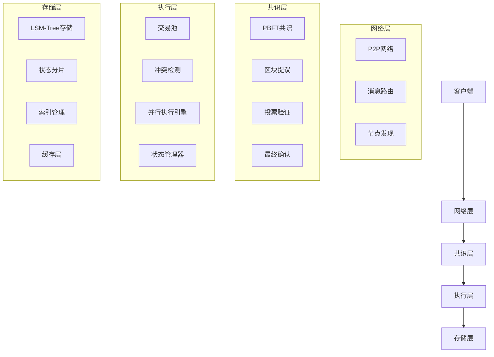

# 高性能区块链架构设计

## 概述

本文档描述了高性能区块链系统的整体架构设计，包括核心组件、技术选型和性能目标。

## 整体架构

## 核心组件设计

### 1. 网络层
- **P2P网络**: 基于libp2p的去中心化网络
- **消息路由**: 高效的消息传递和路由机制
- **节点发现**: 自动节点发现和连接管理

### 2. 共识层
- **共识算法**: PBFT (Practical Byzantine Fault Tolerance)
- **容错能力**: 支持1/3恶意节点
- **最终性**: 亚秒级最终性确认
- **分片支持**: 水平分片和垂直分片

### 3. 执行层
- **交易池**: 高效交易缓存和排序
- **冲突检测**: 基于访问列表的冲突检测
- **并行执行**: 乐观并发控制，支持8-16线程并行
- **状态管理**: 异步状态确认和版本管理

### 4. 存储层
- **存储引擎**: LSM-Tree架构
- **状态分片**: 水平状态分片，解决状态膨胀
- **索引管理**: 高效索引和查询优化
- **缓存策略**: 多级缓存，提高访问性能

## 技术选型

### 1. 共识机制
- **主算法**: PBFT共识
- **备用算法**: HotStuff (用于分片)
- **最终性**: 乐观确认 + 异步确认

### 2. 并行执行
- **执行模型**: 乐观并发控制 (OCC)
- **冲突检测**: 基于访问列表的静态分析
- **调度策略**: 动态负载均衡

### 3. 存储系统
- **存储引擎**: LSM-Tree
- **分片策略**: 一致性哈希分片
- **缓存策略**: LRU + 布隆过滤器

### 4. 网络协议
- **传输协议**: TCP + QUIC
- **发现协议**: Kademlia DHT
- **消息格式**: Protocol Buffers

## 性能目标

### 1. 吞吐量
- **单节点TPS**: 10,000+ 交易/秒
- **集群TPS**: 100,000+ 交易/秒
- **分片扩展**: 线性扩展

### 2. 延迟
- **区块确认**: < 1秒最终性
- **交易确认**: < 500ms
- **网络延迟**: < 100ms

### 3. 扩展性
- **节点数量**: 支持1000+节点
- **状态存储**: 支持TB级状态数据
- **分片数量**: 支持100+分片

### 4. 可用性
- **系统可用性**: 99.9%
- **数据一致性**: 强一致性
- **故障恢复**: < 30秒

## 架构优势

### 1. 高性能
- 并行执行引擎，支持高并发
- LSM-Tree存储，高写入性能
- 多级缓存，低延迟访问

### 2. 高可用
- PBFT共识，强一致性保证
- 分片架构，水平扩展能力
- 故障恢复，自动容错

### 3. 高安全
- 拜占庭容错，抗恶意攻击
- 密码学安全，防重放攻击
- 量子安全，未来兼容

### 4. 高扩展
- 模块化设计，易于扩展
- 分片支持，线性扩展
- 插件化架构，功能扩展 