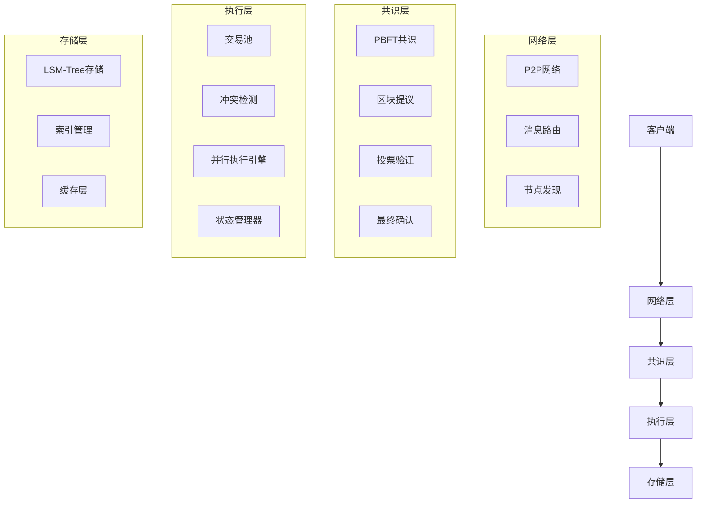

# 高性能区块链架构设计

## 概述

本文档描述了高性能区块链系统的整体架构设计，包括核心组件、技术选型和性能目标。

## 整体架构

## 核心组件设计

### 1. 网络层
- **P2P网络**: 基于libp2p的去中心化网络
- **消息路由**: 高效的消息传递和路由机制
- **节点发现**: 自动节点发现和连接管理

### 2. 共识层
- **共识算法**: PBFT (Practical Byzantine Fault Tolerance)
- **容错能力**: 支持1/3恶意节点
- **最终性**: 亚秒级最终性确认

### 3. 执行层
- **交易池**: 高效交易缓存和排序
- **冲突检测**: 基于访问列表的冲突检测
- **并行执行**: 乐观并发控制，支持8-16线程并行
- **状态管理**: 异步状态确认和版本管理

### 4. 存储层
- **存储引擎**: LSM-Tree架构
- **索引管理**: 高效索引和查询优化
- **缓存策略**: 多级缓存，提高访问性能

## 技术选型

### 1. 共识机制
- **主算法**: PBFT共识
- **最终性**: 乐观确认 + 异步确认

### 2. 并行执行
- **执行模型**: 乐观并发控制
- **冲突检测**: 基于访问列表的静态分析
- **调度策略**: 动态负载均衡

### 3. 存储系统
- **存储引擎**: LSM-Tree
- **缓存策略**: LRU + 布隆过滤器

### 4. 网络协议
- **传输协议**: TCP + QUIC
- **发现协议**: Kademlia DHT
- **消息格式**: Protocol Buffers

## 性能目标

### 1. 吞吐量
- **TPS**: 10,000+ 交易/秒

### 2. 延迟
- **区块确认**: < 1秒最终性
- **交易确认**: < 500ms
- **网络延迟**: < 100ms

### 3. 扩展性
- **水平扩展**: 支持节点动态扩展
- **垂直扩展**: 支持单节点性能提升
- **负载均衡**: 动态负载均衡

## 系统特性

### 1. 高性能
- **并行执行**: 多线程并行处理
- **优化算法**: 高效算法实现
- **硬件加速**: 支持硬件加速
- **缓存优化**: 多级缓存策略

### 2. 高可用性
- **容错设计**: 拜占庭容错
- **故障恢复**: 快速故障恢复
- **负载均衡**: 动态负载均衡
- **监控告警**: 全面监控告警

### 3. 高安全性
- **密码学安全**: 强密码学算法
- **访问控制**: 严格访问控制
- **审计日志**: 完整审计日志
- **安全防护**: 多层安全防护

## 部署架构

### 1. 单机部署
- **开发环境**: 单节点开发环境
- **测试环境**: 单节点测试环境
- **演示环境**: 单节点演示环境

### 2. 集群部署
- **生产环境**: 多节点生产环境
- **高可用**: 高可用集群部署
- **负载均衡**: 负载均衡部署
- **监控管理**: 集群监控管理 