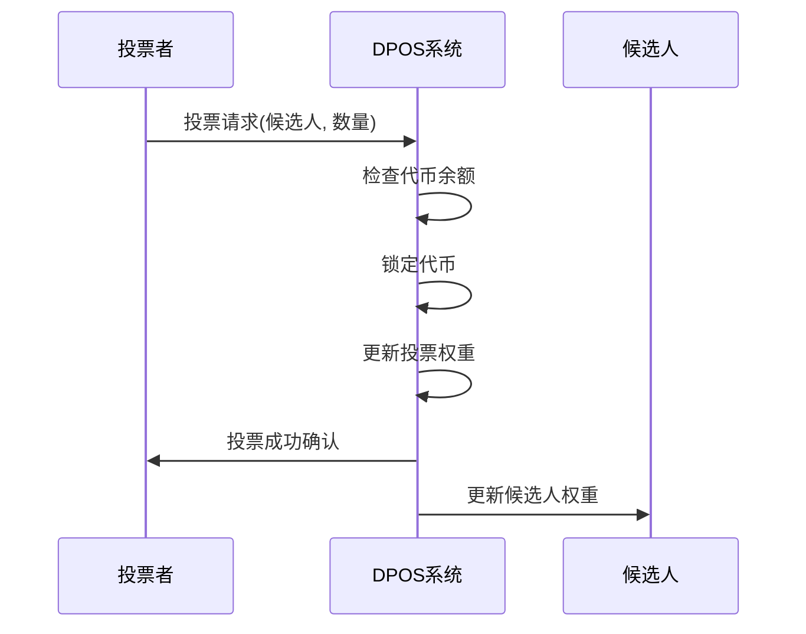
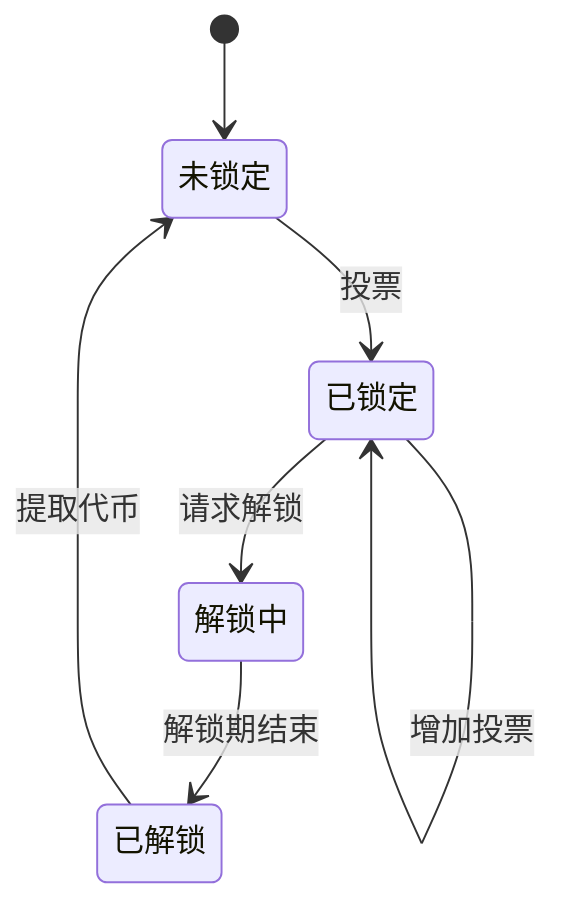
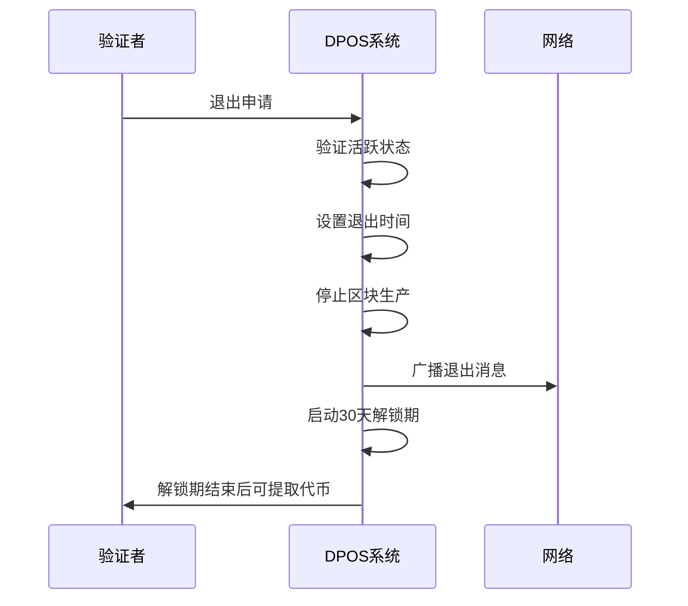

# 共识算法设计

## 概述

本文档描述了高性能区块链系统的共识算法设计，包括DPOS共识和治理模块架构。

## DPOS 共识算法

### 算法概述
- **类型**: 委托权益证明共识
- **验证者数量**: 21个活跃验证者
- **轮换机制**: 每轮21个区块后轮换
- **适用场景**: 高TPS公链应用

### 治理模块架构

#### 独立治理模块
- **模块化设计**: DPOS治理功能独立于共识层
- **交易驱动**: 通过特定类型的交易实现治理功能
- **状态管理**: 维护验证者、投票、锁定等状态
- **状态根**: 提供治理状态根用于区块验证

#### 预定义地址机制
```go
// 系统预留地址（前1024个地址）
const (
    AddressVote              = "0x0000000000000000000000000000000000000001" // 投票
    AddressValidatorRegister = "0x0000000000000000000000000000000000000002" // 验证者注册
    AddressValidatorExit     = "0x0000000000000000000000000000000000000003" // 验证者退出
    AddressUnvote            = "0x0000000000000000000000000000000000000004" // 取消投票
    AddressUnlock            = "0x0000000000000000000000000000000000000005" // 请求解锁
)
```

#### 交易类型识别
- **To地址判断**: 通过交易的To字段判断治理操作类型
- **数据序列化**: 使用gob格式序列化治理数据
- **执行引擎集成**: 执行引擎自动识别并路由治理交易

### 核心流程

#### 1. 投票选举阶段 (Voting)
- **投票者**: 代币持有者参与投票
- **投票权重**: 基于代币持有量计算权重
- **选举规则**: 得票最多的21个候选者成为验证者
- **投票周期**: 每轮结束后重新计算排名

#### 2. 验证者轮换阶段 (Rotation)
- **轮换触发**: 每轮21个区块完成后
- **轮换规则**: 按得票排名重新排序验证者
- **时间窗口**: 每个验证者负责1个区块
- **故障处理**: 验证者故障时跳过该轮次

#### 3. 区块生产阶段 (Block Production)
- **当前验证者**: 按轮次顺序生产区块
- **区块时间**: 每个区块3秒
- **交易打包**: 验证者收集交易并打包
- **区块广播**: 向网络广播新区块

#### 4. 区块确认阶段 (Block Confirmation)
- **快速确认**: 2/3+1个验证者确认
- **最终确认**: 21个区块后最终确认
- **分叉处理**: 最长链原则
- **回滚机制**: 检测到分叉时回滚

### 验证者管理机制

#### 1. 验证者注册
- **注册条件**: 满足最低代币要求
- **注册流程**: 提交注册交易
- **保证金**: 需要锁定一定数量代币
- **声誉系统**: 基于历史表现评分

#### 2. 投票机制
- **投票权重**: 1代币 = 1投票权
- **投票锁定**: 投票时代币立即锁定，防止投票操纵
- **投票更新**: 可随时增加投票，立即生效
- **投票解锁**: 需要7天解锁期，防止频繁变动
- **解锁请求**: 投票者可随时请求解锁部分或全部代币

#### 3. 代币锁定管理
- **立即锁定**: 投票时代币立即锁定，计入验证者权重
- **解锁期**: 普通投票7天解锁期，验证者退出30天解锁期
- **解锁队列**: 系统维护解锁请求队列，定期处理
- **状态跟踪**: 跟踪代币锁定、解锁中、已解锁等状态

#### 4. 验证者退出机制
- **退出申请**: 活跃验证者可申请退出
- **退出锁定**: 退出后立即停止区块生产
- **代币解锁**: 30天解锁期后质押代币可提取
- **声誉影响**: 恶意退出可能影响声誉评分

#### 3. 奖励分配
- **区块奖励**: 每个区块产生奖励
- **奖励分配**: 按验证者权重分配
- **手续费**: 交易手续费归验证者
- **通胀控制**: 年通胀率控制在5%以内

## 投票和锁定机制

### 1. 投票流程

#### 投票操作


#### 投票特点
- **即时生效**: 投票立即计入验证者权重
- **代币锁定**: 投票时代币立即锁定，防止双重投票
- **可累加**: 可多次投票给同一候选人，权重累加
- **部分解锁**: 可解锁部分投票，无需全部解锁

### 2. 代币锁定机制

#### 锁定状态


#### 锁定规则
- **投票锁定**: 投票时代币立即锁定
- **解锁期**: 普通投票7天，验证者退出30天
- **解锁队列**: 系统每分钟检查解锁请求
- **状态跟踪**: 实时跟踪锁定状态

### 3. 验证者退出流程

#### 退出机制


#### 退出特点
- **立即生效**: 退出后立即停止区块生产
- **解锁期**: 30天解锁期，防止恶意退出
- **声誉影响**: 恶意退出影响声誉评分
- **代币安全**: 解锁期保护代币安全

### 4. 验证者列表更新

#### 更新机制
- **定期更新**: 按配置的投票周期定期更新
- **权重排序**: 按投票权重重新排序验证者
- **活跃验证者**: 选择前N个验证者作为活跃验证者
- **轮换机制**: 每轮21个区块后重新排序

#### 更新特点
- **投票者可随时投票**: 投票立即生效
- **验证者列表定期更新**: 防止频繁变动
- **权重实时计算**: 基于锁定代币计算权重
- **排除解锁中投票**: 解锁中的投票不计入权重

## 快速最终性机制

### 1. 快速确认
- **机制**: 2/3+1个验证者确认即可快速确认
- **优势**: 高吞吐量，低延迟
- **特点**: 支持大规模网络
- **适用**: 大规模部署

### 2. 最终确认
- **机制**: 21个区块后最终确认
- **安全性**: 防止分叉攻击
- **时间**: 约63秒最终确认
- **不可逆**: 最终确认后不可回滚

## 共识性能优化

### 1. 消息优化
- **消息压缩**: 减少网络带宽使用
- **批量处理**: 提高消息处理效率
- **异步通信**: 减少同步开销

### 2. 网络优化
- **P2P网络**: 去中心化网络拓扑
- **消息路由**: 高效消息传递
- **连接管理**: 动态连接优化

### 3. 存储优化
- **状态缓存**: 减少存储访问
- **索引优化**: 快速状态查询
- **压缩存储**: 减少存储空间

## 安全性考虑

### 1. 投票安全
- **投票权重**: 基于代币持有量
- **投票锁定**: 防止投票操纵
- **声誉机制**: 基于历史表现
- **惩罚机制**: 恶意行为惩罚

### 2. 密码学安全
- **数字签名**: 基于椭圆曲线密码学
- **哈希算法**: SHA256/Keccak256
- **密钥管理**: 安全的密钥生成和存储
- **网络签名**: libp2p框架自动处理消息签名和验证

### 3. 攻击防护
- **双重支付**: 防止双重支付攻击
- **分叉攻击**: 最长链原则防护
- **投票攻击**: 投票权重机制防护
- **验证者攻击**: 轮换机制防护

## DPOS优势

### 1. 高性能
- **高TPS**: 可达10,000+ TPS
- **低延迟**: 3秒区块确认
- **高扩展性**: 支持大规模网络

### 2. 去中心化
- **投票民主**: 代币持有者参与治理
- **验证者轮换**: 防止权力集中
- **透明公开**: 所有操作公开透明

### 3. 经济激励
- **奖励机制**: 验证者获得奖励
- **投票激励**: 投票者分享收益
- **惩罚机制**: 恶意行为惩罚 