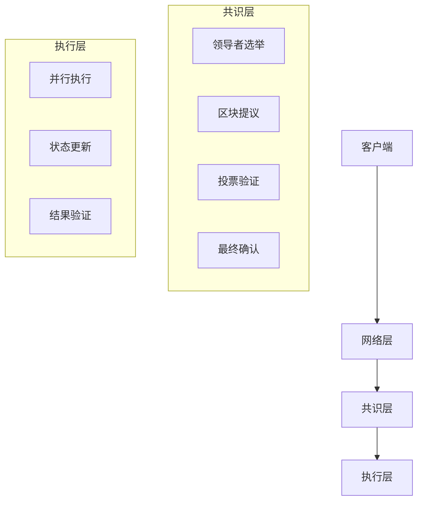
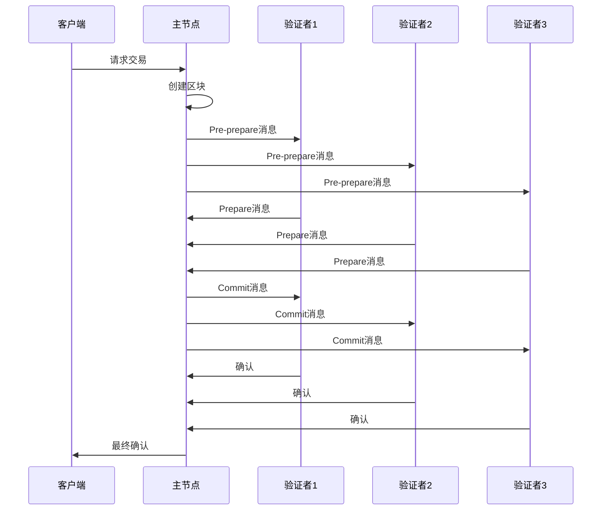
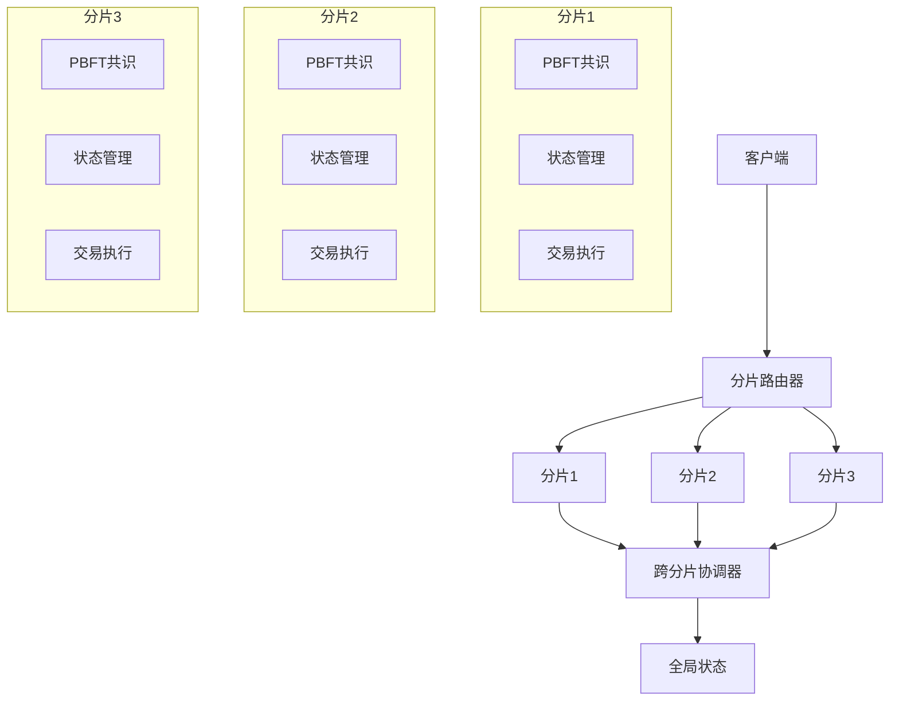

# 共识算法设计

## 概述

本文档描述了高性能区块链系统的共识算法设计，包括PBFT共识、分片共识和快速最终性机制。

## 共识算法分类

### 1. 经典共识算法

#### PoW (Proof of Work)
- **特点**: 计算密集型，能源消耗大
- **安全性**: 51%攻击抵抗
- **性能**: 低TPS，高延迟
- **适用场景**: 去中心化程度要求极高的场景

#### PoS (Proof of Stake)
- **特点**: 权益证明，能源友好
- **安全性**: 经济激励驱动
- **性能**: 中等TPS，中等延迟
- **适用场景**: 现代区块链主流选择

### 2. 拜占庭容错 (BFT)

#### PBFT (Practical Byzantine Fault Tolerance)
- **特点**: 实用拜占庭容错算法
- **容错能力**: 支持1/3恶意节点
- **性能**: 高TPS，低延迟
- **最终性**: 强最终性保证
- **适用场景**: 企业级区块链，高性能要求

#### HotStuff
- **特点**: 线性视图切换
- **性能**: 亚秒级最终性
- **复杂度**: O(n)消息复杂度
- **适用场景**: 分片共识，大规模网络

### 3. 混合共识

#### Tendermint
- **特点**: 基于PBFT的共识引擎
- **性能**: 1000+ TPS
- **最终性**: 强最终性
- **适用场景**: 企业级区块链，快速确认

## 高性能共识设计

### 1. 分层共识架构

### 2. PBFT共识流程

### 3. 快速最终性机制

#### 乐观确认
- **机制**: 当超过2/3验证者确认时，立即最终化
- **优势**: 快速确认，低延迟
- **风险**: 可能存在分叉风险
- **适用**: 高信任环境

#### 异步确认
- **机制**: 主节点立即提议，备份节点异步确认
- **优势**: 高吞吐量，低延迟
- **特点**: 支持大规模网络
- **适用**: 大规模部署

### 4. 分片共识

#### 水平分片
- **特点**: 按状态空间分片
- **优势**: 线性扩展，高吞吐量
- **挑战**: 跨分片交易协调
- **适用**: 大规模状态管理

#### 垂直分片
- **特点**: 按功能层次分片
- **优势**: 功能隔离，安全性强
- **挑战**: 跨层通信开销
- **适用**: 复杂业务场景

### 5. 分片共识架构

## 共识性能优化

### 1. 消息优化
- **消息压缩**: 减少网络带宽使用
- **批量处理**: 提高消息处理效率
- **异步通信**: 减少同步开销

### 2. 网络优化
- **P2P网络**: 去中心化网络拓扑
- **消息路由**: 高效消息传递
- **连接管理**: 动态连接优化

### 3. 存储优化
- **状态缓存**: 减少存储访问
- **索引优化**: 快速状态查询
- **压缩存储**: 减少存储空间

## 安全性考虑

### 1. 拜占庭容错
- **容错能力**: 支持1/3恶意节点
- **攻击防护**: 防止双重支付攻击
- **分叉防护**: 防止网络分叉

### 2. 密码学安全
- **数字签名**: 基于椭圆曲线密码学
- **哈希算法**: SHA256/Keccak256
- **密钥管理**: 安全的密钥生成和存储

### 3. 量子安全
- **后量子密码学**: 抗量子计算攻击
- **迁移策略**: 平滑迁移到量子安全算法
- **兼容性**: 保持向后兼容 