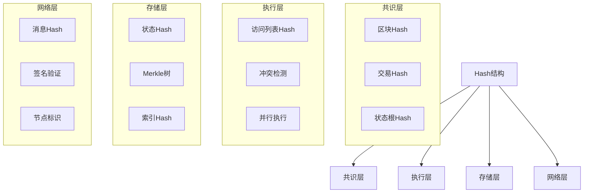
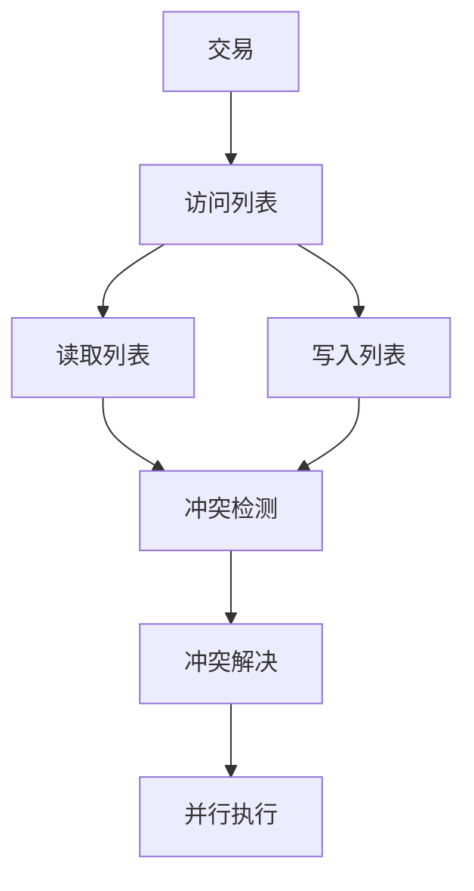
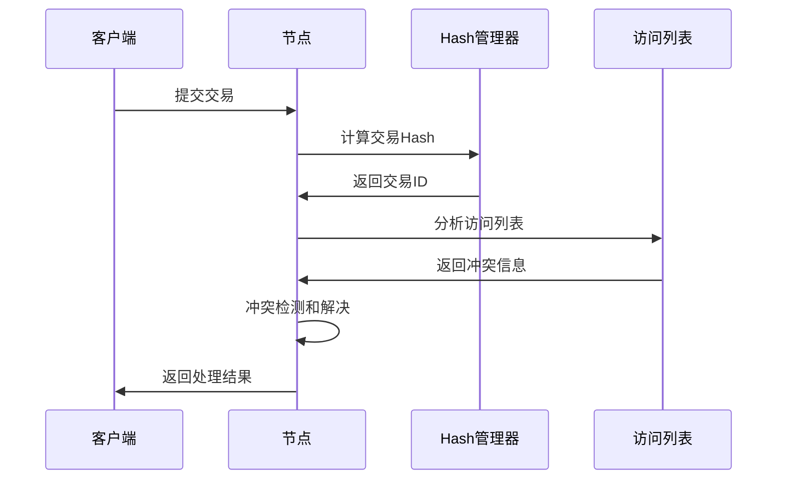
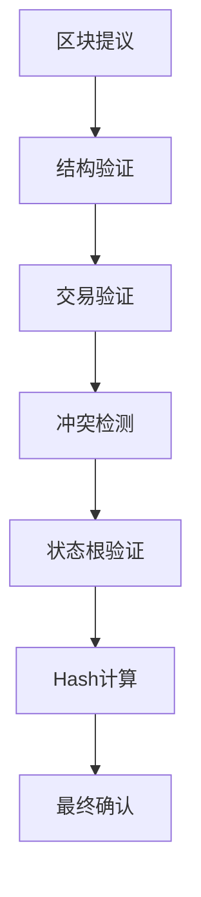
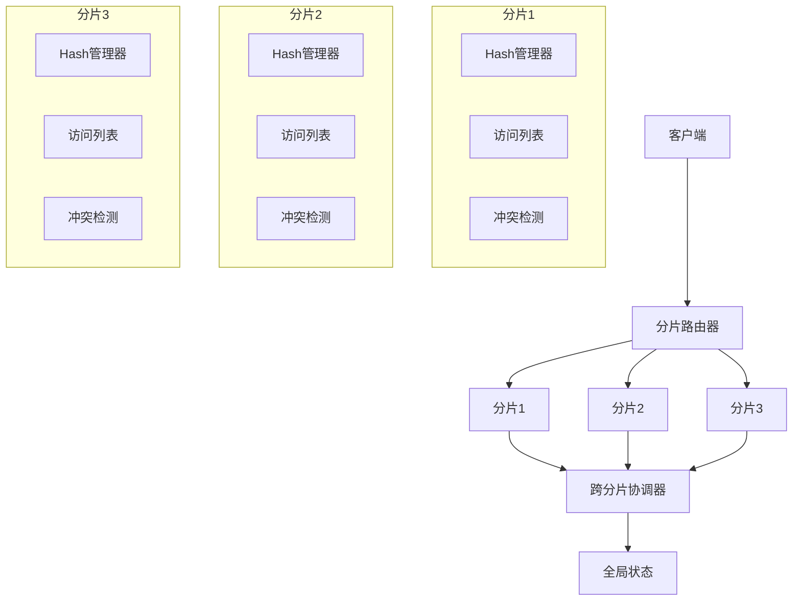

# Hash结构设计

## 概述

本文档描述了高性能区块链系统中的Hash结构设计，包括统一Hash类型、性能优化、安全性考虑以及与整体架构的集成。

## 核心设计理念

### 1. 统一Hash类型
- 所有hash值都使用统一的Hash类型，确保类型安全
- 支持多种密码学安全的hash算法（SHA256、Keccak256、Blake2b等）
- 提供标准化的接口和操作

### 2. 性能优化
- 零拷贝设计，减少内存分配
- 内存池管理，提高对象复用
- 缓存友好的数据结构设计
- 并行计算支持

### 3. 安全性
- 密码学安全的hash算法
- 防碰撞和防重放攻击设计
- 量子计算威胁考虑
- 标准化接口和验证

### 4. 可扩展性
- 支持多种hash算法扩展
- 分片兼容设计
- 跨分片交易支持
- 水平扩展能力

## 架构集成

## Hash结构设计

### 1. 基础Hash类型
- **Hash长度**: 32字节统一长度
- **数据类型**: 固定长度字节数组
- **序列化**: 支持JSON序列化
- **比较操作**: 支持相等和大小比较

### 2. Hash算法支持
- **SHA256**: 标准SHA256算法
- **Keccak256**: 以太坊兼容算法
- **Blake2b**: 高性能Blake2b算法
- **SHA3_256**: SHA3标准算法

### 3. Hash管理器
- **算法注册**: 支持动态算法注册
- **默认算法**: 可配置默认算法
- **缓存支持**: 内置缓存机制
- **内存池**: 对象池管理

## 访问列表设计

### 1. 访问列表结构
- **读取列表**: 交易读取的对象hash列表
- **写入列表**: 交易写入的对象hash列表
- **冲突检测**: 基于访问列表的冲突检测
- **合并操作**: 支持访问列表合并

### 2. 冲突检测机制
- **静态检测**: 基于访问列表的静态分析
- **动态检测**: 运行时冲突检测
- **冲突解决**: 多种冲突解决策略
- **性能优化**: 高效的冲突检测算法

### 3. 访问列表架构

## 交易结构设计

### 1. 交易结构
- **交易ID**: 基于Hash的交易标识
- **访问列表**: 交易访问对象列表
- **数据字段**: 交易数据内容
- **签名信息**: 数字签名和验证

### 2. 交易验证
- **结构验证**: 交易结构完整性验证
- **签名验证**: 数字签名验证
- **访问列表验证**: 访问列表有效性验证
- **冲突检测**: 交易冲突检测

### 3. 交易处理流程

## 区块结构设计

### 1. 区块结构
- **区块头**: 包含元数据信息
- **交易列表**: 区块包含的交易
- **状态根**: 基于上一个区块的状态根
- **区块Hash**: 区块完整性验证

### 2. 区块验证
- **结构验证**: 区块结构完整性验证
- **交易验证**: 交易有效性验证
- **状态根验证**: 状态根一致性验证
- **Hash验证**: 区块Hash验证

### 3. 区块处理流程

## 性能优化

### 1. 内存优化
- **对象池**: Hash对象池管理
- **零拷贝**: 减少内存拷贝操作
- **缓存策略**: 多级缓存优化
- **内存映射**: 大文件内存映射

### 2. 计算优化
- **并行计算**: 支持并行Hash计算
- **硬件加速**: 支持硬件加速
- **算法优化**: 算法性能优化
- **批量处理**: 批量Hash计算

### 3. 缓存优化
- **Hash缓存**: Hash计算结果缓存
- **访问列表缓存**: 访问列表缓存
- **冲突检测缓存**: 冲突检测结果缓存
- **LRU策略**: 最近最少使用策略

## 安全性考虑

### 1. 密码学安全
- **算法安全**: 使用密码学安全算法
- **碰撞抵抗**: 防碰撞攻击设计
- **预像攻击**: 防预像攻击
- **第二预像攻击**: 防第二预像攻击

### 2. 防重放攻击
- **Nonce机制**: 交易Nonce管理
- **时间戳验证**: 时间戳有效性验证
- **序列号**: 交易序列号管理
- **重放检测**: 重放攻击检测

### 3. 量子安全
- **后量子算法**: 支持后量子密码学算法
- **迁移策略**: 量子安全迁移策略
- **兼容性**: 保持向后兼容
- **风险评估**: 量子威胁风险评估

## 分片支持

### 1. 分片Hash
- **分片标识**: 基于Hash的分片标识
- **一致性哈希**: 一致性哈希分片
- **负载均衡**: 动态负载均衡
- **故障恢复**: 自动故障恢复

### 2. 跨分片交易
- **跨分片标识**: 跨分片交易标识
- **协调机制**: 跨分片协调机制
- **一致性保证**: 跨分片一致性保证
- **性能优化**: 跨分片性能优化

### 3. 分片架构

## 监控和调优

### 1. 性能监控
- **Hash计算性能**: Hash计算延迟和吞吐量
- **冲突检测性能**: 冲突检测效率
- **内存使用**: 内存使用情况
- **缓存命中率**: 缓存命中率统计

### 2. 安全监控
- **攻击检测**: 安全攻击检测
- **异常监控**: 异常行为监控
- **审计日志**: 完整审计日志
- **安全报告**: 安全状态报告

### 3. 性能调优
- **参数调优**: 系统参数调优
- **算法优化**: 算法性能优化
- **资源优化**: 资源使用优化
- **容量规划**: 系统容量规划

## 扩展性设计

### 1. 算法扩展
- **新算法支持**: 支持新Hash算法
- **插件架构**: 插件化算法架构
- **动态加载**: 动态算法加载
- **版本管理**: 算法版本管理

### 2. 功能扩展
- **新功能支持**: 支持新功能扩展
- **API扩展**: 灵活的API设计
- **接口标准化**: 标准接口设计
- **兼容性**: 向后兼容性保证

### 3. 性能扩展
- **水平扩展**: 水平性能扩展
- **垂直扩展**: 垂直性能扩展
- **分布式扩展**: 分布式扩展
- **云原生**: 云原生支持 