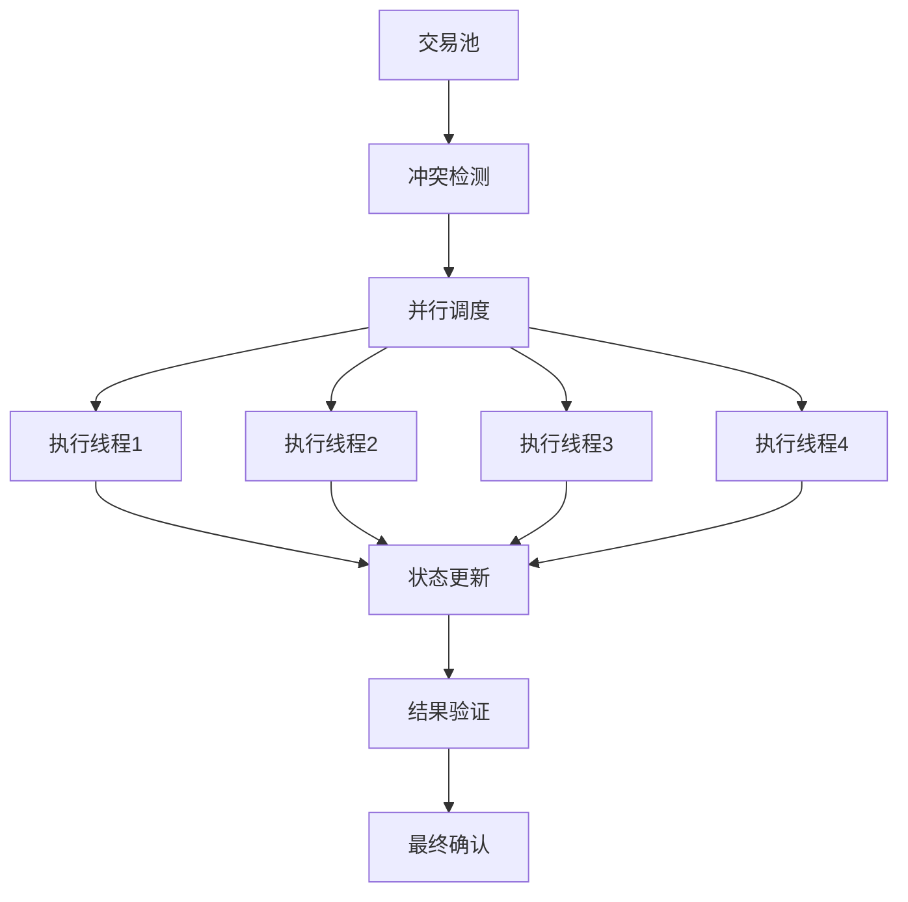

# 高性能区块链设计方案

## 概述

本文档描述了高性能区块链系统的设计方案，包括核心设计理念、架构设计和性能优化策略。

## 核心设计理念

### 1. PBFT共识 + 快速最终性
- 采用PBFT共识算法，支持亚秒级最终性
- 3f+1节点容错，支持1/3恶意节点
- 线性视图切换，减少共识开销

### 2. 异步状态确认机制
- 区块包含交易列表，状态确认基于上一个区块
- 当前区块只验证交易冲突，不计算状态根
- 状态根验证与区块处理并行进行

### 3. 基于访问列表的并行处理
- 交易包含访问对象hash列表
- 快速冲突检测和并行调度
- 无冲突交易并行执行

## 核心组件设计

### 1. PBFT共识引擎
- **三阶段共识**: Pre-prepare、Prepare、Commit
- **容错能力**: 支持1/3恶意节点
- **最终性**: 强最终性保证
- **性能**: 高TPS，低延迟

### 2. 异步状态确认
- **状态根**: 基于上一个区块的状态根
- **冲突检测**: 快速交易冲突检测
- **并行处理**: 状态确认与区块处理并行
- **回滚机制**: 支持交易回滚

### 3. 基于访问列表的并行处理
- **访问列表**: 交易包含读写对象列表
- **冲突检测**: 静态冲突检测算法
- **并行调度**: 动态负载均衡调度
- **版本管理**: 乐观并发控制

## 并行执行架构

## 性能优化策略

### 1. 内存优化
- **对象池**: 减少内存分配和GC压力
- **内存映射**: 提高大文件访问性能
- **缓存策略**: 多级缓存，提高命中率

### 2. 网络优化
- **消息压缩**: 减少网络带宽使用
- **批量处理**: 提高消息处理效率
- **连接复用**: 减少连接建立开销

### 3. 存储优化
- **LSM-Tree**: 高写入性能存储引擎
- **状态分片**: 解决状态膨胀问题
- **索引优化**: 快速状态查询

### 4. 计算优化
- **并行执行**: 多线程并行处理
- **向量化**: SIMD指令优化
- **JIT编译**: 动态代码优化

## 冲突检测机制

### 1. 静态冲突检测
- **访问列表分析**: 基于交易访问列表
- **冲突图构建**: 构建交易冲突图
- **分组策略**: 无冲突交易分组

### 2. 动态冲突检测
- **运行时检测**: 执行时冲突检测
- **回滚机制**: 冲突时自动回滚
- **重试策略**: 冲突交易重试

### 3. 冲突解决策略
- **优先级调度**: 基于交易优先级
- **时间戳排序**: 基于时间戳排序
- **费用优化**: 基于交易费用优化

## 状态管理

### 1. 状态存储
- **LSM-Tree**: 高写入性能存储
- **状态分片**: 水平状态分片
- **缓存层**: 多级缓存策略

### 2. 状态同步
- **增量同步**: 增量状态同步
- **快照同步**: 定期快照同步
- **验证机制**: 状态一致性验证

### 3. 状态压缩
- **数据压缩**: 状态数据压缩
- **历史清理**: 历史状态清理
- **归档策略**: 长期归档策略

## 性能监控

### 1. 性能指标
- **TPS**: 每秒交易处理量
- **延迟**: 交易确认延迟
- **吞吐量**: 系统吞吐量
- **资源使用**: CPU、内存、网络使用

### 2. 监控系统
- **实时监控**: 实时性能监控
- **告警机制**: 性能告警机制
- **日志分析**: 性能日志分析

### 3. 性能调优
- **瓶颈分析**: 性能瓶颈分析
- **参数调优**: 系统参数调优
- **容量规划**: 系统容量规划

## 安全性考虑

### 1. 共识安全
- **拜占庭容错**: 抗恶意节点攻击
- **双重支付防护**: 防止双重支付
- **分叉防护**: 防止网络分叉

### 2. 执行安全
- **访问控制**: 严格的访问控制
- **权限管理**: 细粒度权限管理
- **审计日志**: 完整的审计日志

### 3. 数据安全
- **加密存储**: 敏感数据加密
- **备份恢复**: 数据备份和恢复
- **隐私保护**: 用户隐私保护

## 扩展性设计

### 1. 水平扩展
- **分片架构**: 水平状态分片
- **负载均衡**: 动态负载均衡
- **自动扩缩容**: 自动容量调整

### 2. 垂直扩展
- **功能模块化**: 功能模块化设计
- **插件架构**: 插件化架构
- **API扩展**: 灵活的API设计

### 3. 跨链扩展
- **跨链协议**: 标准跨链协议
- **互操作性**: 链间互操作性
- **桥接机制**: 跨链桥接机制 