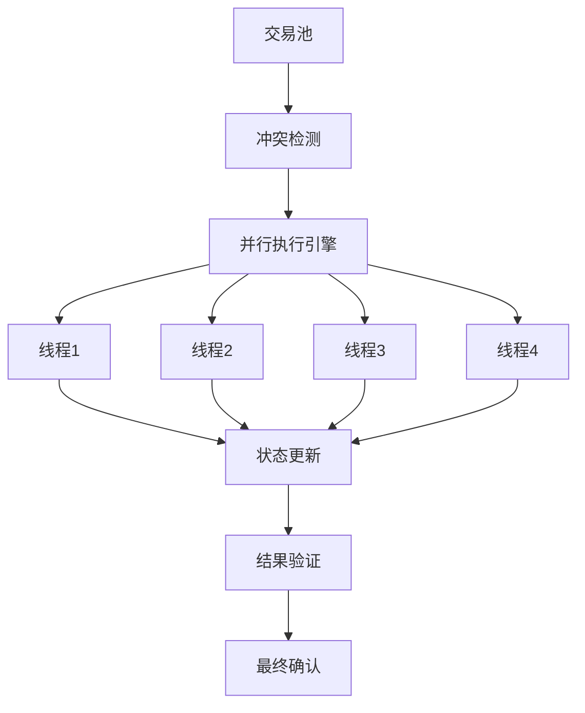

# 高性能设计

## 概述

本文档描述了高性能区块链系统的性能优化设计，包括并行执行、存储优化和网络优化。

## 并行执行设计

### 1. 乐观并发控制

#### 执行模型
- **乐观执行**: 假设无冲突的并行执行
- **冲突检测**: 基于访问列表的静态分析
- **冲突解决**: 多种冲突解决策略
- **回滚机制**: 支持事务回滚

#### 冲突检测机制
- **访问列表**: 交易读写对象列表
- **静态分析**: 基于访问列表的静态分析
- **动态检测**: 运行时冲突检测
- **冲突解决**: 多种冲突解决策略

### 2. 并行执行架构

### 3. 调度策略
- **动态调度**: 基于负载的动态调度
- **负载均衡**: 线程间负载均衡
- **优先级调度**: 基于优先级的调度
- **资源管理**: 资源使用管理

## 存储优化设计

### 1. LSM-Tree存储引擎

#### 架构设计
- **内存层**: MemTable + WriteBuffer
- **磁盘层**: 多级SSTable
- **合并策略**: 分层合并策略
- **压缩算法**: 多种压缩算法

#### 性能优化
- **批量写入**: 批量写入优化
- **异步刷新**: 异步刷新机制
- **压缩优化**: 压缩比优化
- **索引优化**: 高效索引设计

### 2. 缓存层设计

#### 多级缓存
- **L1缓存**: 热点数据缓存
- **L2缓存**: 常用数据缓存
- **L3缓存**: 冷数据缓存
- **缓存策略**: LRU + LFU混合策略

#### 缓存优化
- **预读取**: 智能预读取
- **缓存预热**: 缓存预热机制
- **缓存淘汰**: 智能淘汰策略
- **缓存一致性**: 缓存一致性保证

## 网络优化设计

### 1. P2P网络优化

#### 网络拓扑
- **去中心化**: 去中心化网络拓扑
- **节点发现**: 自动节点发现
- **连接管理**: 动态连接管理
- **路由优化**: 高效消息路由

#### 消息优化
- **消息压缩**: 减少网络带宽使用
- **批量处理**: 提高消息处理效率
- **异步通信**: 减少同步开销
- **消息缓存**: 消息缓存机制

### 2. 传输协议优化

#### 协议选择
- **TCP**: 可靠传输协议
- **QUIC**: 快速传输协议
- **UDP**: 低延迟传输
- **协议切换**: 动态协议切换

#### 连接优化
- **连接池**: 连接池管理
- **连接复用**: 连接复用机制
- **负载均衡**: 连接负载均衡
- **故障转移**: 连接故障转移

## 性能监控

### 1. 性能指标

#### 吞吐量指标
- **TPS**: 交易处理速度
- **QPS**: 查询处理速度
- **IOPS**: 输入输出操作速度
- **带宽**: 网络带宽使用

#### 延迟指标
- **响应时间**: 请求响应时间
- **处理延迟**: 交易处理延迟
- **网络延迟**: 网络传输延迟
- **存储延迟**: 存储访问延迟

### 2. 监控系统

#### 监控架构
- **数据收集**: 性能数据收集
- **数据存储**: 监控数据存储
- **数据分析**: 性能数据分析
- **告警机制**: 智能告警机制

#### 监控工具
- **系统监控**: 系统资源监控
- **应用监控**: 应用性能监控
- **网络监控**: 网络性能监控
- **存储监控**: 存储性能监控

## 性能调优

### 1. 系统调优

#### 操作系统调优
- **内核参数**: 内核参数优化
- **文件系统**: 文件系统优化
- **网络参数**: 网络参数优化
- **内存管理**: 内存管理优化

#### 应用调优
- **算法优化**: 算法性能优化
- **数据结构**: 数据结构优化
- **并发控制**: 并发控制优化
- **资源管理**: 资源使用优化

### 2. 硬件优化

#### CPU优化
- **多核利用**: 多核CPU利用
- **缓存优化**: CPU缓存优化
- **指令优化**: 指令级优化
- **向量化**: SIMD指令优化

#### 内存优化
- **内存分配**: 内存分配优化
- **内存访问**: 内存访问优化
- **内存压缩**: 内存压缩技术
- **内存池**: 内存池管理

#### 存储优化
- **SSD优化**: SSD性能优化
- **RAID配置**: RAID配置优化
- **文件系统**: 文件系统优化
- **IO调度**: IO调度优化

## 扩展性设计

### 1. 水平扩展

#### 节点扩展
- **节点添加**: 动态节点添加
- **负载均衡**: 动态负载均衡
- **一致性保证**: 分布式一致性

#### 服务扩展
- **服务拆分**: 微服务架构
- **服务发现**: 服务发现机制
- **服务治理**: 服务治理框架
- **API网关**: API网关设计

### 2. 垂直扩展

#### 单机扩展
- **硬件升级**: 硬件资源升级
- **性能优化**: 单机性能优化
- **资源管理**: 资源使用管理
- **容量规划**: 容量规划策略

#### 功能扩展
- **模块化设计**: 模块化架构设计
- **插件机制**: 插件化机制
- **API扩展**: 灵活的API设计
- **接口标准化**: 标准接口设计 