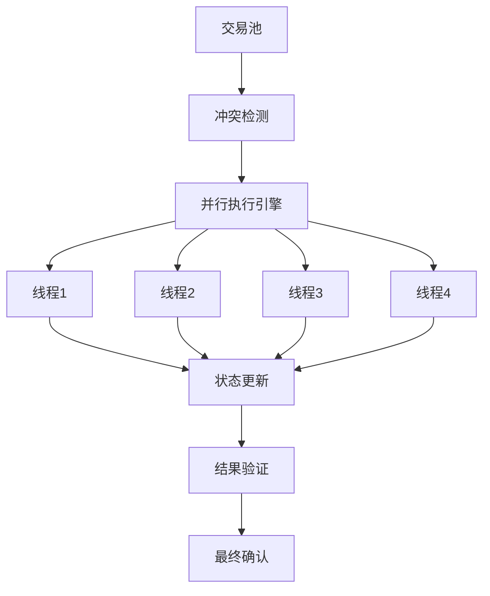
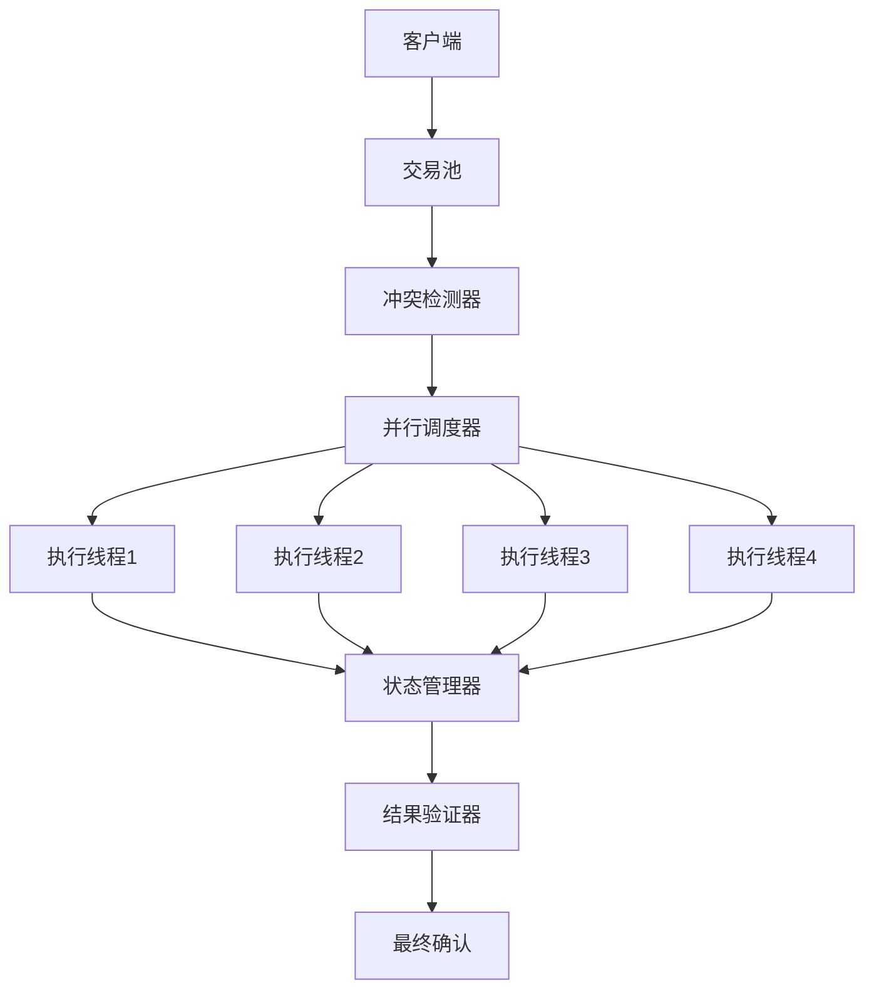

# 并行执行设计

## 概述

本文档描述了高性能区块链系统的并行执行设计，包括并行执行模型、冲突检测机制和性能优化策略。

## 并行执行模型

### 1. 乐观并发控制

#### 执行原理
- **乐观假设**: 假设交易间无冲突
- **并行执行**: 无冲突交易并行执行
- **冲突检测**: 基于访问列表的静态分析
- **冲突解决**: 多种冲突解决策略

#### 执行流程

### 2. 访问列表机制

#### 访问列表结构
- **读取列表**: 交易读取的对象hash列表
- **写入列表**: 交易写入的对象hash列表
- **冲突检测**: 基于访问列表的冲突检测
- **合并操作**: 支持访问列表合并

#### 冲突检测算法
- **静态检测**: 基于访问列表的静态分析
- **动态检测**: 运行时冲突检测
- **冲突解决**: 多种冲突解决策略
- **性能优化**: 高效的冲突检测算法

## 冲突检测机制

### 1. 静态冲突检测

#### 检测算法
- **访问列表分析**: 基于交易访问列表
- **冲突图构建**: 构建交易冲突图
- **分组策略**: 无冲突交易分组
- **调度优化**: 动态调度优化

#### 冲突类型
- **读写冲突**: 读操作与写操作冲突
- **依赖冲突**: 交易间依赖关系冲突

### 2. 动态冲突检测

#### 运行时检测
- **执行时检测**: 执行时冲突检测
- **回滚机制**: 冲突时自动回滚
- **重试策略**: 冲突交易重试
- **性能监控**: 冲突检测性能监控

#### 冲突解决策略
- **优先级调度**: 基于交易优先级
- **时间戳排序**: 基于时间戳排序
- **费用优化**: 基于交易费用优化
- **公平调度**: 公平调度策略

## 并行执行架构

### 1. 执行引擎设计

#### 核心组件
- **交易池**: 高效交易缓存和排序
- **冲突检测器**: 基于访问列表的冲突检测
- **并行调度器**: 动态负载均衡调度
- **状态管理器**: 异步状态确认和版本管理

#### 架构设计

### 2. 线程管理

#### 线程池设计
- **线程数量**: 可配置线程数量
- **任务队列**: 任务队列管理
- **负载均衡**: 线程间负载均衡
- **资源管理**: 线程资源管理

#### 调度策略
- **动态调度**: 基于负载的动态调度
- **优先级调度**: 基于优先级的调度
- **公平调度**: 公平调度策略
- **资源调度**: 基于资源的调度

## 性能优化

### 1. 内存优化

#### 对象池管理
- **对象池**: 减少内存分配和GC压力
- **内存复用**: 对象内存复用
- **缓存友好**: 缓存友好的数据结构
- **内存压缩**: 内存压缩技术

#### 内存访问优化
- **内存布局**: 优化内存布局
- **缓存策略**: 多级缓存策略
- **预读取**: 智能预读取
- **内存映射**: 大文件内存映射

### 2. 计算优化

#### 并行计算
- **多线程**: 多线程并行处理
- **向量化**: SIMD指令优化
- **JIT编译**: 动态代码优化
- **硬件加速**: 硬件加速支持

#### 算法优化
- **算法选择**: 高效算法选择
- **数据结构**: 优化数据结构
- **缓存优化**: 计算缓存优化
- **预计算**: 预计算优化

### 3. 存储优化

#### 存储访问
- **批量访问**: 批量存储访问
- **异步IO**: 异步IO操作
- **缓存策略**: 存储缓存策略
- **压缩存储**: 数据压缩存储

#### 索引优化
- **索引结构**: 高效索引结构
- **索引缓存**: 索引缓存优化
- **查询优化**: 查询性能优化
- **索引维护**: 索引维护优化

## 监控和调优

### 1. 性能监控

#### 监控指标
- **吞吐量**: 交易处理吞吐量
- **延迟**: 交易处理延迟
- **冲突率**: 交易冲突率
- **资源使用**: CPU、内存、IO使用

#### 监控系统
- **实时监控**: 实时性能监控
- **告警机制**: 性能告警机制
- **日志分析**: 性能日志分析
- **报告生成**: 性能报告生成

### 2. 性能调优

#### 参数调优
- **线程数量**: 线程数量调优
- **缓存大小**: 缓存大小调优
- **队列大小**: 队列大小调优
- **超时设置**: 超时时间设置

#### 算法调优
- **冲突检测**: 冲突检测算法调优
- **调度策略**: 调度策略调优
- **内存管理**: 内存管理调优
- **存储优化**: 存储访问优化

## 扩展性设计

### 1. 水平扩展

#### 节点扩展
- **节点添加**: 动态节点添加
- **负载均衡**: 动态负载均衡
- **一致性保证**: 分布式一致性

#### 服务扩展
- **服务拆分**: 微服务架构
- **服务发现**: 服务发现机制
- **服务治理**: 服务治理框架
- **API网关**: API网关设计

### 2. 垂直扩展

#### 单机扩展
- **硬件升级**: 硬件资源升级
- **性能优化**: 单机性能优化
- **资源管理**: 资源使用管理
- **容量规划**: 容量规划策略

#### 功能扩展
- **模块化设计**: 模块化架构设计
- **插件机制**: 插件化机制
- **API扩展**: 灵活的API设计
- **接口标准化**: 标准接口设计 