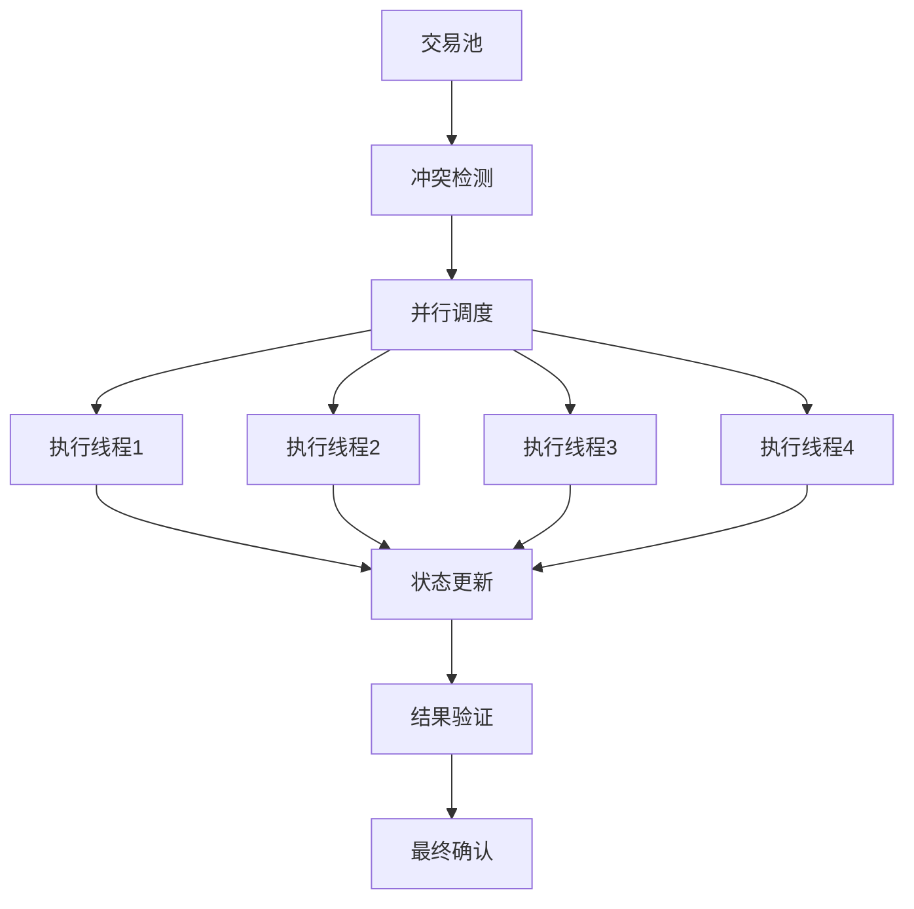
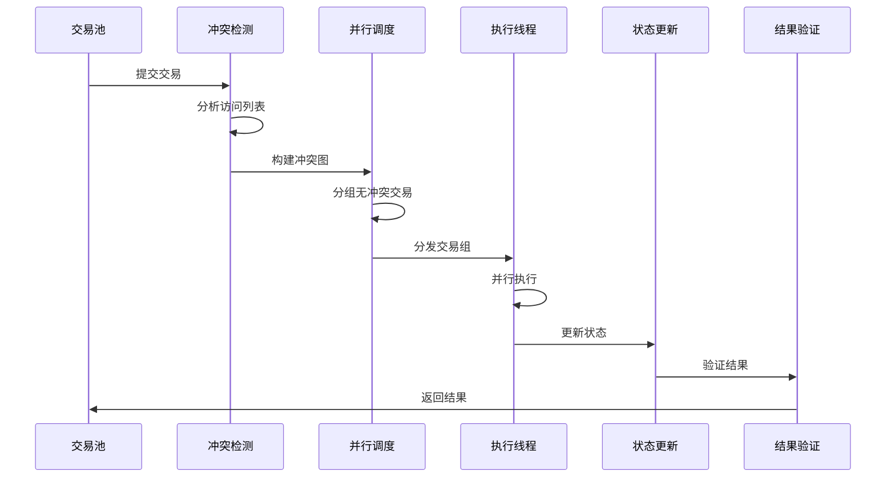

# 并行执行引擎设计

## 概述

本文档描述了高性能区块链系统的并行执行引擎设计，包括核心概念、解决方案和实现策略。

## 核心概念

### 并行 vs 并发
- **并行**: 多个线程同时执行不同任务
- **并发**: 单个线程交替处理多个任务

### 数据竞争问题
在区块链中，主要挑战是数据竞争：
- 读写冲突 (Read-Write Conflict)
- 写写冲突 (Write-Write Conflict)
- 数据危害 (Data Hazard)

## 并行执行架构

## 解决方案

### 1. 乐观并发控制 (Optimistic Concurrency Control)
- **执行策略**: 假设无冲突，执行时检测冲突
- **冲突检测**: 基于访问列表的静态分析
- **回滚机制**: 冲突时自动回滚和重试
- **版本管理**: 支持多版本并发控制

### 2. 访问列表调度
- **访问列表**: 交易包含读写对象列表
- **冲突检测**: 静态冲突检测算法
- **分组策略**: 无冲突交易分组
- **调度优化**: 动态负载均衡

### 3. 版本管理
- **版本控制**: 支持多版本状态管理
- **快照隔离**: 提供快照隔离级别
- **回滚支持**: 支持交易回滚
- **状态合并**: 支持状态合并

## 冲突检测机制

### 1. 静态冲突检测
- **访问列表分析**: 基于交易访问列表
- **冲突图构建**: 构建交易冲突图
- **分组策略**: 无冲突交易分组
- **优化算法**: 图着色算法优化

### 2. 动态冲突检测
- **运行时检测**: 执行时冲突检测
- **回滚机制**: 冲突时自动回滚
- **重试策略**: 冲突交易重试
- **性能监控**: 冲突率监控

### 3. 冲突解决策略
- **优先级调度**: 基于交易优先级
- **时间戳排序**: 基于时间戳排序
- **费用优化**: 基于交易费用优化
- **公平性保证**: 保证交易公平性

## 并行执行流程

## 实现策略

### 第一阶段：基础并行执行
- **多线程执行**: 实现简单的多线程执行
- **冲突检测**: 基于访问列表的冲突检测
- **回滚机制**: 基本的回滚机制

### 第二阶段：优化调度
- **智能排序**: 智能交易排序
- **负载均衡**: 动态负载均衡
- **内存优化**: 内存使用优化

### 第三阶段：高级特性
- **预测性执行**: 预测性执行优化
- **缓存优化**: 缓存策略优化
- **自适应调度**: 自适应调度算法

## 性能优化

### 1. 内存优化
- **对象池**: 减少内存分配和GC压力
- **内存映射**: 提高大文件访问性能
- **缓存策略**: 多级缓存，提高命中率

### 2. 计算优化
- **并行执行**: 多线程并行处理
- **向量化**: SIMD指令优化
- **JIT编译**: 动态代码优化

### 3. 网络优化
- **消息压缩**: 减少网络带宽使用
- **批量处理**: 提高消息处理效率
- **连接复用**: 减少连接建立开销

## 监控和调优

### 1. 性能监控
- **TPS监控**: 每秒交易处理量
- **延迟监控**: 交易确认延迟
- **冲突率监控**: 交易冲突率
- **资源使用监控**: CPU、内存、网络使用

### 2. 性能调优
- **瓶颈分析**: 性能瓶颈分析
- **参数调优**: 系统参数调优
- **容量规划**: 系统容量规划

### 3. 故障处理
- **故障检测**: 自动故障检测
- **故障恢复**: 快速故障恢复
- **降级策略**: 系统降级策略

## 安全性考虑

### 1. 执行安全
- **访问控制**: 严格的访问控制
- **权限管理**: 细粒度权限管理
- **审计日志**: 完整的审计日志

### 2. 数据安全
- **状态一致性**: 保证状态一致性
- **事务隔离**: 提供事务隔离
- **回滚安全**: 安全的回滚机制

### 3. 系统安全
- **资源限制**: 资源使用限制
- **异常处理**: 异常情况处理
- **安全审计**: 安全审计机制

## 扩展性设计

### 1. 水平扩展
- **分片支持**: 支持状态分片
- **负载均衡**: 动态负载均衡
- **自动扩缩容**: 自动容量调整

### 2. 垂直扩展
- **功能模块化**: 功能模块化设计
- **插件架构**: 插件化架构
- **API扩展**: 灵活的API设计

### 3. 跨链扩展
- **跨链协议**: 标准跨链协议
- **互操作性**: 链间互操作性
- **桥接机制**: 跨链桥接机制 