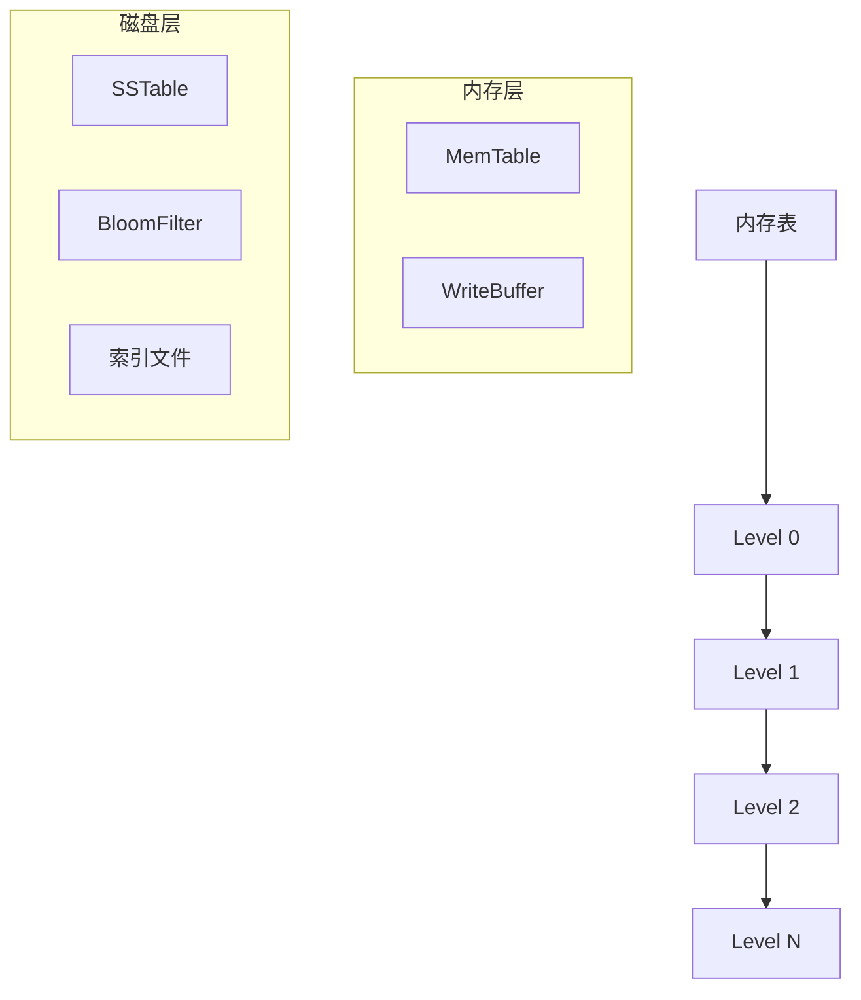
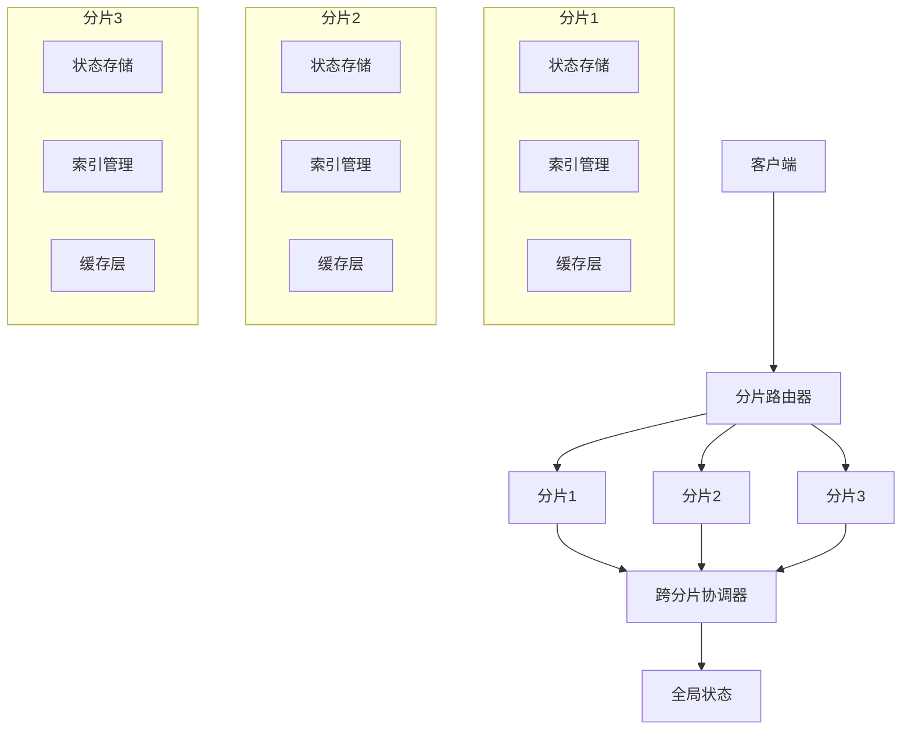
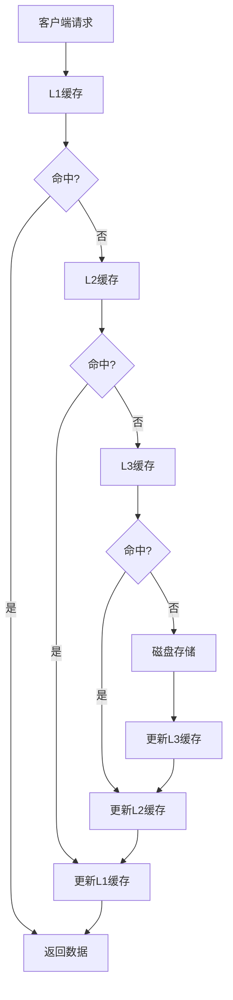

# 存储系统设计

## 概述

本文档描述了高性能区块链系统的存储系统设计，包括LSM-Tree存储引擎、状态分片和缓存层设计。

## LSM-Tree 存储引擎

### 架构设计

### 核心组件

#### 1. MemTable
- **数据结构**: 跳表 (SkipList)
- **内存管理**: 动态内存分配
- **写入性能**: 高写入性能
- **容量限制**: 可配置容量限制

#### 2. SSTable
- **文件格式**: 排序字符串表
- **索引结构**: 稀疏索引
- **布隆过滤器**: 快速查询优化
- **压缩算法**: 多种压缩算法支持

#### 3. 合并策略
- **分层合并**: 按层级合并策略
- **大小分级**: 基于文件大小分级
- **压缩优化**: 压缩比优化
- **后台处理**: 异步合并处理

## 状态分片

### 分片策略
- **一致性哈希**: 基于一致性哈希分片
- **负载均衡**: 动态负载均衡
- **故障恢复**: 自动故障恢复
- **扩展性**: 支持动态扩展

### 分片架构

### 跨分片事务
- **协调机制**: 两阶段提交协议
- **一致性保证**: 强一致性保证
- **性能优化**: 并行处理优化
- **故障处理**: 故障恢复机制

## 缓存层设计

### 多级缓存
- **L1缓存**: 热点数据缓存
- **L2缓存**: 常用数据缓存
- **L3缓存**: 冷数据缓存
- **缓存策略**: LRU + LFU混合策略

### 缓存架构

## 性能优化

### 1. 写入优化
- **批量写入**: 批量写入优化
- **异步刷新**: 异步刷新机制
- **压缩算法**: 多种压缩算法
- **写入缓冲**: 写入缓冲区优化

### 2. 读取优化
- **布隆过滤器**: 快速查询过滤
- **索引缓存**: 索引缓存优化
- **预读取**: 智能预读取
- **并行读取**: 并行读取优化

### 3. 内存管理
- **对象池**: 对象池管理
- **内存映射**: 内存映射优化
- **垃圾回收**: 垃圾回收优化
- **内存压缩**: 内存压缩技术

## 数据一致性

### 1. 强一致性
- **ACID特性**: 保证ACID特性
- **事务隔离**: 提供事务隔离
- **并发控制**: 并发控制机制
- **故障恢复**: 故障恢复机制

### 2. 最终一致性
- **异步复制**: 异步数据复制
- **冲突解决**: 冲突解决机制
- **数据合并**: 数据合并策略
- **一致性检查**: 一致性检查机制

### 3. 数据验证
- **哈希验证**: 数据哈希验证
- **签名验证**: 数字签名验证
- **完整性检查**: 数据完整性检查
- **审计日志**: 完整审计日志

## 备份和恢复

### 1. 备份策略
- **增量备份**: 增量备份策略
- **全量备份**: 定期全量备份
- **快照备份**: 快照备份机制
- **异地备份**: 异地备份策略

### 2. 恢复机制
- **快速恢复**: 快速恢复机制
- **点恢复**: 时间点恢复
- **增量恢复**: 增量恢复策略
- **灾难恢复**: 灾难恢复机制

### 3. 数据保护
- **加密存储**: 数据加密存储
- **访问控制**: 严格访问控制
- **审计跟踪**: 完整审计跟踪
- **合规性**: 合规性保证

## 监控和管理

### 1. 性能监控
- **吞吐量监控**: 读写吞吐量监控
- **延迟监控**: 读写延迟监控
- **资源监控**: 资源使用监控
- **容量监控**: 存储容量监控

### 2. 故障管理
- **故障检测**: 自动故障检测
- **故障恢复**: 快速故障恢复
- **告警机制**: 智能告警机制
- **日志分析**: 日志分析系统

### 3. 容量管理
- **容量规划**: 容量规划策略
- **自动扩缩容**: 自动容量调整
- **资源优化**: 资源使用优化
- **成本控制**: 存储成本控制

## 扩展性设计

### 1. 水平扩展
- **分片扩展**: 水平分片扩展
- **负载均衡**: 动态负载均衡
- **自动扩缩容**: 自动容量调整
- **跨区域扩展**: 跨区域扩展

### 2. 垂直扩展
- **功能模块化**: 功能模块化设计
- **插件架构**: 插件化架构
- **API扩展**: 灵活的API设计
- **接口标准化**: 标准接口设计

### 3. 跨链扩展
- **跨链协议**: 标准跨链协议
- **互操作性**: 链间互操作性
- **桥接机制**: 跨链桥接机制
- **数据同步**: 跨链数据同步 