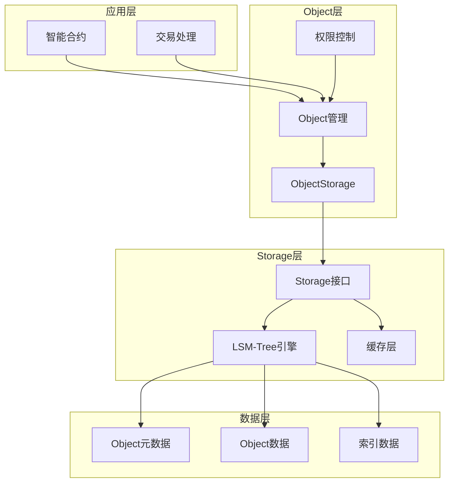
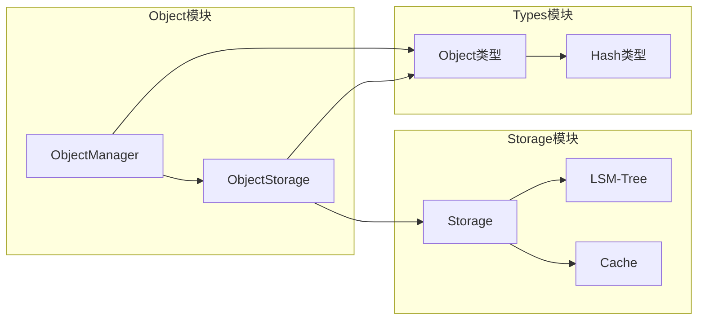
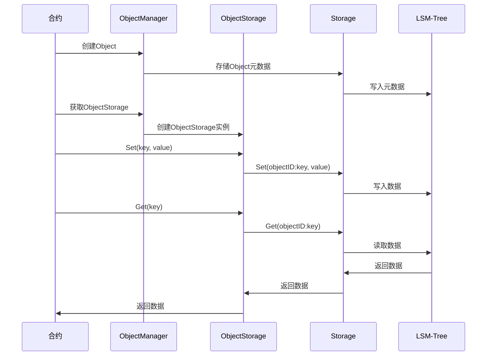

# Storage模块Object概念设计 - 架构文档

## 整体架构图



## 分层设计和核心组件

### 1. Object管理层
- **ObjectManager**: 负责Object的创建、删除、转移等生命周期管理
- **ObjectStorage**: 继承Storage功能，提供Object语义的存储操作

### 2. 存储层
- **Object元数据存储**: 存储Object的基本信息（ID、Owner、Contract、过期时间）
- **Object数据存储**: 存储Object内部的key-value数据
- **索引存储**: 存储Owner和Contract到Object的映射关系

### 3. 接口层
- **Object接口**: 提供Object的CRUD操作
- **Storage接口**: 继承现有Storage接口，提供Object语义的存储操作

## 模块依赖关系图



## 接口契约定义

### 1. Object接口
```go
type ObjectManager interface {
    // 创建Object
    CreateObject(owner, contract []byte) (*Object, error)
    
    // 获取Object
    GetObject(id Hash) (*Object, error)
    
    // 转移Object
    TransferObject(id Hash, newOwner []byte) error
    
    // 删除Object
    DeleteObject(id Hash) error
    
    // 检查Object是否过期
    IsExpired(id Hash) (bool, error)
    
    // 获取Object的Storage接口
    GetObjectStorage(id Hash) (*ObjectStorage, error)
}
```

### 2. ObjectStorage接口
```go
type ObjectStorage struct {
    *Storage
    objectID Hash
}

// Get 获取Object内的数据
func (os *ObjectStorage) Get(key []byte) ([]byte, error)

// Set 设置Object内的数据
func (os *ObjectStorage) Set(key, value []byte) error

// Delete 删除Object内的数据
func (os *ObjectStorage) Delete(key []byte) error
```


## 数据流向图



## 异常处理策略

### 1. 权限异常
- **权限验证**: 由应用层处理，storage模块不进行权限验证
- **权限错误**: 应用层在调用storage接口前进行权限检查

### 2. 数据异常
- **Object不存在**: 返回Object不存在错误
- **Object已过期**: 返回Object已过期错误
- **数据损坏**: 返回数据损坏错误

### 3. 系统异常
- **存储异常**: 返回存储错误，记录日志
- **网络异常**: 返回网络错误，支持重试
- **内存异常**: 返回内存不足错误

## 设计原则

### 1. 继承原则
- ObjectStorage继承Storage的所有功能
- 保持与现有Storage接口的完全兼容性

### 2. 隔离原则
- 每个Object的数据通过objectID前缀进行隔离
- 不同Object之间的数据完全独立

### 3. 权限原则
- 权限验证由应用层处理
- storage模块提供纯存储功能
- 应用层负责权限控制和访问验证

### 4. 生命周期原则
- Object有明确的过期时间
- 自动清理过期Object
- 支持Object的转移和删除

## 性能优化策略

### 1. 缓存优化
- Object元数据缓存
- 热点Object数据缓存
- 权限验证结果缓存

### 2. 索引优化
- Owner到Object的索引
- Contract到Object的索引
- 过期时间索引

### 3. 批量操作
- 批量创建Object
- 批量转移Object
- 批量清理过期Object

## 安全考虑

### 1. 数据安全
- Object数据通过objectID前缀隔离
- 严格的权限验证
- 数据完整性检查

### 2. 访问安全
- 访问控制由应用层处理
- storage模块提供数据隔离
- 应用层负责审计日志记录

### 3. 系统安全
- 防止Object ID冲突
- 通过objectID前缀实现数据隔离
- 应用层负责权限安全控制
