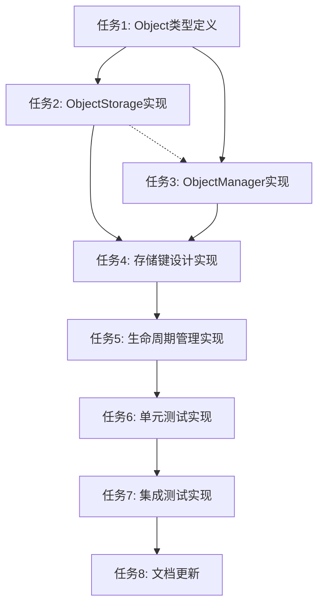

# Storage模块Object概念设计 - 任务拆分文档

## 子任务拆分

### 任务1: Object类型定义
**输入契约**:
- 前置依赖: 无
- 输入数据: 现有types模块
- 环境依赖: Go环境

**输出契约**:
- 输出数据: Object结构体定义
- 交付物: types/object.go
- 验收标准: Object结构体包含ID、Owner、Contract、ExpiresAt字段

**实现约束**:
- 技术栈: Go语言
- 接口规范: 使用现有Hash类型
- 质量要求: 结构体定义清晰，字段类型正确

**依赖关系**:
- 后置任务: 任务2、任务3
- 并行任务: 无

### 任务2: ObjectStorage实现
**输入契约**:
- 前置依赖: 任务1
- 输入数据: 现有Storage模块
- 环境依赖: Go环境

**输出契约**:
- 输出数据: ObjectStorage结构体和方法
- 交付物: storage/object_storage.go
- 验收标准: ObjectStorage继承Storage功能，提供Get/Set/Delete方法

**实现约束**:
- 技术栈: Go语言
- 接口规范: 与Storage接口完全兼容
- 质量要求: 正确实现数据隔离，性能良好

**依赖关系**:
- 后置任务: 任务4
- 并行任务: 任务3

### 任务3: ObjectManager实现
**输入契约**:
- 前置依赖: 任务1
- 输入数据: 现有Storage模块
- 环境依赖: Go环境

**输出契约**:
- 输出数据: ObjectManager结构体和方法
- 交付物: storage/object_manager.go
- 验收标准: 实现Object的创建、获取、转移、删除功能

**实现约束**:
- 技术栈: Go语言
- 接口规范: 提供完整的Object生命周期管理
- 质量要求: 正确处理Object元数据，支持过期检查

**依赖关系**:
- 后置任务: 任务4
- 并行任务: 任务2

### 任务4: 存储键设计实现
**输入契约**:
- 前置依赖: 任务2、任务3
- 输入数据: 现有存储键设计
- 环境依赖: Go环境

**输出契约**:
- 输出数据: Object存储键生成逻辑
- 交付物: storage/object_keys.go
- 验收标准: 正确生成Object元数据、数据、索引的存储键

**实现约束**:
- 技术栈: Go语言
- 接口规范: 使用统一的前缀设计
- 质量要求: 键设计合理，避免冲突

**依赖关系**:
- 后置任务: 任务5
- 并行任务: 无

### 任务5: 生命周期管理实现
**输入契约**:
- 前置依赖: 任务4
- 输入数据: 现有时间处理逻辑
- 环境依赖: Go环境

**输出契约**:
- 输出数据: Object生命周期管理逻辑
- 交付物: storage/object_lifecycle.go
- 验收标准: 正确处理Object创建、过期检查、清理功能

**实现约束**:
- 技术栈: Go语言
- 接口规范: 使用int64时间戳
- 质量要求: 生命周期管理准确，性能良好

**依赖关系**:
- 后置任务: 任务6
- 并行任务: 无

### 任务6: 单元测试实现
**输入契约**:
- 前置依赖: 任务5
- 输入数据: 所有Object相关代码
- 环境依赖: Go测试环境

**输出契约**:
- 输出数据: 完整的单元测试
- 交付物: storage/object_test.go
- 验收标准: 测试覆盖率达到80%以上，所有功能正常

**实现约束**:
- 技术栈: Go语言测试框架
- 接口规范: 使用标准testing包
- 质量要求: 测试用例完整，边界条件覆盖

**依赖关系**:
- 后置任务: 任务7
- 并行任务: 无

### 任务7: 集成测试实现
**输入契约**:
- 前置依赖: 任务6
- 输入数据: 完整Object模块
- 环境依赖: Go测试环境

**输出契约**:
- 输出数据: 集成测试
- 交付物: storage/object_integration_test.go
- 验收标准: 与现有Storage模块集成正常

**实现约束**:
- 技术栈: Go语言测试框架
- 接口规范: 测试与现有模块的集成
- 质量要求: 集成测试通过，性能符合要求

**依赖关系**:
- 后置任务: 任务8
- 并行任务: 无

### 任务8: 文档更新
**输入契约**:
- 前置依赖: 任务7
- 输入数据: 所有实现代码
- 环境依赖: Markdown环境

**输出契约**:
- 输出数据: 更新的文档
- 交付物: docs/storage-object-design/IMPLEMENTATION_storage_object.md
- 验收标准: 文档完整，与实现一致

**实现约束**:
- 技术栈: Markdown
- 接口规范: 文档格式规范
- 质量要求: 文档准确，易于理解

**依赖关系**:
- 后置任务: 无
- 并行任务: 无

## 任务依赖图

## 复杂度评估

### 任务复杂度分析
1. **任务1**: 低复杂度 - 简单的类型定义
2. **任务2**: 中等复杂度 - 需要正确实现继承和封装
3. **任务3**: 中等复杂度 - 需要实现完整的生命周期管理
4. **任务4**: 低复杂度 - 简单的键设计逻辑
5. **任务5**: 中等复杂度 - 需要处理时间逻辑和清理机制
6. **任务6**: 中等复杂度 - 需要全面的测试覆盖
7. **任务7**: 中等复杂度 - 需要测试集成场景
8. **任务8**: 低复杂度 - 文档编写

### 总体复杂度评估
- **总任务数**: 8个
- **平均复杂度**: 中等
- **关键路径**: 任务1 → 任务2/3 → 任务4 → 任务5 → 任务6 → 任务7 → 任务8
- **预计工作量**: 中等（约2-3天）

## 风险控制

### 技术风险
1. **继承实现风险**: ObjectStorage继承Storage可能遇到接口兼容性问题
   - **缓解措施**: 仔细设计继承结构，充分测试接口兼容性

2. **数据隔离风险**: Object数据隔离可能不够彻底
   - **缓解措施**: 使用严格的键前缀设计，充分测试数据隔离

3. **性能风险**: Object操作可能影响现有存储性能
   - **缓解措施**: 优化实现，进行性能测试

### 集成风险
1. **向后兼容风险**: 可能影响现有功能
   - **缓解措施**: 严格遵循现有接口，充分测试兼容性

2. **测试覆盖风险**: 测试可能不够全面
   - **缓解措施**: 制定详细的测试计划，确保覆盖所有场景

## 质量门控

### 代码质量
- 代码规范符合项目标准
- 错误处理完善
- 注释清晰完整

### 测试质量
- 单元测试覆盖率≥80%
- 集成测试通过
- 性能测试符合要求

### 文档质量
- 文档与实现一致
- 接口文档完整
- 使用示例清晰
