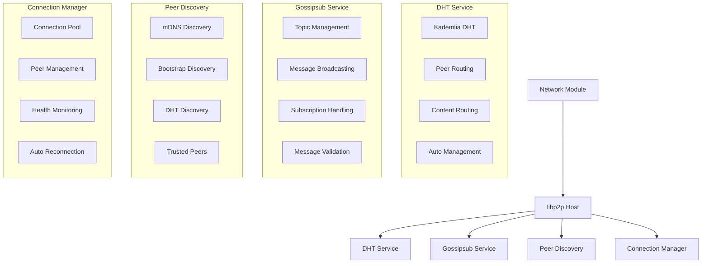
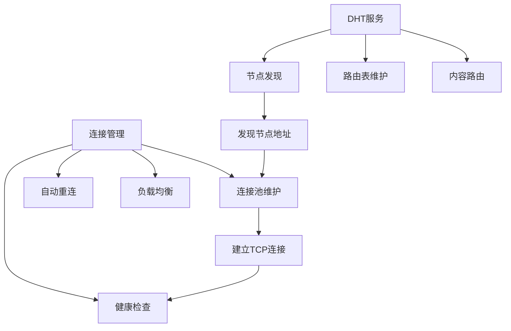
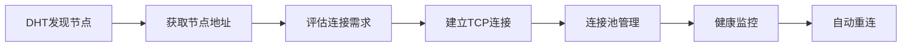
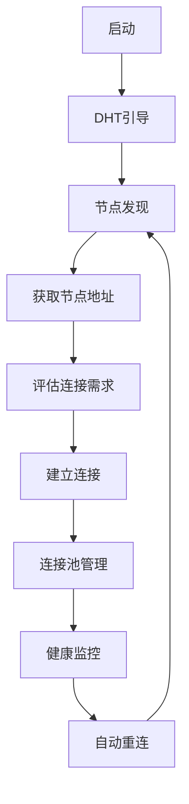

# Network Module - 基于libp2p的现代化P2P网络

## 概述

Network模块基于[libp2p](https://github.com/libp2p)官方库实现，提供了完整的P2P网络功能，包括**自动节点发现**、**DHT自动管理**、**Gossipsub消息传播**、**智能连接管理**等核心功能。

## 架构设计



## 核心功能

### 1. 自动节点发现 🎯

Network模块具备强大的自动节点发现能力，无需手动管理：

#### 发现机制

1. **mDNS发现**: 本地网络自动发现
   - 自动发现同一局域网内的其他节点
   - 零配置，即插即用
   - 适用于本地开发和测试环境

2. **Bootstrap发现**: 基于预配置节点的发现
   - 连接到预配置的bootstrap节点
   - 通过bootstrap节点发现更多节点
   - 适用于生产环境

3. **DHT发现**: 基于DHT的节点发现
   - 利用DHT网络自动发现节点
   - 去中心化，无需中心化服务器
   - 支持大规模网络

4. **可信节点**: 基于配置的可信节点连接
   - 优先连接可信节点
   - 确保网络连通性
   - 支持动态添加和移除

#### 发现优先级


### 2. DHT自动管理 🎯

DHT服务完全自动化，无需手动干预：

#### 自动管理特性

- **自动引导**: 启动时自动连接到DHT网络
- **路由表管理**: 自动维护Kademlia路由表
- **节点健康检查**: 定期检查节点连通性
- **网络分区恢复**: 自动检测和恢复网络分区
- **负载均衡**: 自动平衡网络负载

#### DHT功能

- **节点发现**: 自动发现网络中的其他节点
- **内容路由**: 基于内容哈希的内容查找
- **网络拓扑**: 维护去中心化的网络拓扑
- **故障恢复**: 自动处理节点故障和网络分区

#### DHT vs 连接管理的关系



**为什么有了DHT还需要连接管理？**

1. **职责分工**
   - **DHT**: 负责节点发现和路由信息，不负责TCP连接维护
   - **连接管理**: 负责实际的TCP连接维护、健康检查、自动重连

2. **实际需求**
   - 应用需要知道哪些节点已连接
   - 需要处理连接断开和重连
   - 需要管理连接数量和质量
   - 需要负载均衡和故障转移

3. **自动化程度**
   - **DHT层面**: 完全自动化，无需手动干预
   - **连接层面**: 基于DHT发现结果，自动建立和维护连接

#### DHT API

```go
// 获取DHT实例（用于高级操作）
func (n *Network) GetDHT() *dht.IpfsDHT

// 查找节点
func (n *Network) FindPeer(peerID peer.ID) (peer.AddrInfo, error)

// 获取DHT统计信息
func (n *Network) GetDHTStats() map[string]interface{}

// 获取DHT路由表大小
func (n *Network) GetDHTRoutingTable() (int, error)
```

### 3. Gossipsub 消息传播

基于Gossipsub协议的高效消息传播系统：

#### 核心特性

- **高效广播**: 基于gossip的消息传播，减少网络开销
- **主题管理**: 支持多个主题的订阅和发布
- **消息验证**: 内置消息签名和验证
- **网络分区容错**: 自动处理网络分区
- **消息去重**: 自动去除重复消息

#### Gossipsub API

```go
// 广播消息
func (n *Network) BroadcastMessage(topic string, data []byte) error

// 订阅主题
func (n *Network) SubscribeToTopic(topicName string) error

// 获取主题列表
func (n *Network) ListTopics() []string

// 获取主题中的节点
func (n *Network) GetTopicPeers(topicName string) []peer.ID

// 注册消息处理器
func (n *Network) RegisterMessageHandler(topicName string, handler MessageHandler)
```

### 4. 智能连接管理

基于DHT发现的自动化连接管理系统：

#### 与DHT的协作关系



#### 管理特性

- **基于DHT发现**: 利用DHT发现的节点信息建立连接
- **连接池管理**: 自动管理连接数量，避免连接过多
- **健康监控**: 定期检查连接健康状态
- **自动重连**: 连接断开时自动重连
- **负载均衡**: 智能分配连接负载
- **连接优化**: 自动优化连接质量

#### 连接管理API

```go
// 获取连接的节点
func (n *Network) GetPeers() []*PeerInfo

// 连接到指定节点
func (n *Network) ConnectToPeer(addr string) error

// 检查节点是否已连接
func (n *Network) IsPeerConnected(peerID peer.ID) bool
```

## 配置说明

### 网络配置

```yaml
network:
  # 基础配置
  port: 26656                    # 监听端口
  host: "0.0.0.0"               # 监听地址
  max_peers: 50                 # 最大连接节点数
  
  # 发现配置
  discovery: true               # 启用节点发现
  bootstrap: true               # 启用bootstrap发现
  
  # 可信节点配置
  trusted_peers:
    - "/ip4/192.168.1.100/tcp/26656/p2p/QmYyQSo1c1Ym7orWxLYvCrM2EmxFTANf8wXmmE7DWjhx5N"
    - "/ip4/192.168.1.101/tcp/26656/p2p/QmYyQSo1c1Ym7orWxLYvCrM2EmxFTANf8wXmmE7DWjhx5N"
  
  # DHT配置
  dht:
    mode: "server"              # DHT模式: server/client
    protocol_prefix: "/chain"   # 协议前缀
    auto_discovery: true        # 启用自动发现
    routing_table_refresh: "5m" # 路由表刷新间隔
    
  # Gossipsub配置
  gossipsub:
    message_signing: true       # 启用消息签名
    strict_verification: true   # 严格签名验证
    max_message_size: 1048576   # 最大消息大小(1MB)
    
  # 连接管理配置
  connection:
    max_connections: 100        # 最大连接数
    connection_timeout: 30s     # 连接超时
    keep_alive_interval: 60s    # 保活间隔
    health_check_interval: 5m   # 健康检查间隔
```

## 使用示例

### 1. 基础使用

```go
package main

import (
    "context"
    "log"
    "time"
    
    "github.com/govm-net/chain/config"
    "github.com/govm-net/chain/network"
)

func main() {
    // 加载配置
    cfg, err := config.Load("config.yaml")
    if err != nil {
        log.Fatal(err)
    }
    
    // 创建网络实例
    net, err := network.New(cfg.Network, nil)
    if err != nil {
        log.Fatal(err)
    }
    
    // 启动网络（自动开始节点发现和DHT管理）
    if err := net.Start(); err != nil {
        log.Fatal(err)
    }
    
    // 注册消息处理器
    net.RegisterMessageHandler("blocks", func(peerID peer.ID, data []byte) error {
        log.Printf("收到区块消息: %s", string(data))
        return nil
    })
    
    // 订阅主题
    if err := net.SubscribeToTopic("blocks"); err != nil {
        log.Fatal(err)
    }
    
    // 广播消息
    if err := net.BroadcastMessage("blocks", []byte("Hello, World!")); err != nil {
        log.Fatal(err)
    }
    
    // 等待网络稳定
    time.Sleep(10 * time.Second)
    
    // 查看网络状态
    peers := net.GetPeers()
    log.Printf("当前连接节点数: %d", len(peers))
    
    // 查看DHT状态
    stats := net.GetDHTStats()
    log.Printf("DHT状态: %+v", stats)
    
    // 等待
    select {}
}
```

### 2. 节点发现监控

```go
// 监控节点发现过程
go func() {
    ticker := time.NewTicker(30 * time.Second)
    defer ticker.Stop()
    
    for {
        select {
        case <-ticker.C:
            peers := net.GetPeers()
            stats := net.GetDHTStats()
            
            log.Printf("网络状态:")
            log.Printf("  - 连接节点数: %d", len(peers))
            log.Printf("  - DHT路由表大小: %v", stats["routing_table_size"])
            log.Printf("  - DHT模式: %v", stats["mode"])
        }
    }
}()
```

### 3. 可信节点管理

```go
// 检查可信节点连接状态
trustedPeers := net.GetTrustedPeers()
for _, peerID := range trustedPeers {
    if net.IsPeerConnected(peerID) {
        log.Printf("可信节点 %s 已连接", peerID.String())
    } else {
        log.Printf("可信节点 %s 未连接", peerID.String())
    }
}

// 动态添加可信节点
err := net.AddTrustedPeer("/ip4/192.168.1.100/tcp/26656/p2p/QmYyQSo1c1Ym7orWxLYvCrM2EmxFTANf8wXmmE7DWjhx5N")
if err != nil {
    log.Printf("添加可信节点失败: %v", err)
}
```

## 自动管理特性

### 1. 节点自动发现

- **零配置**: 启动后自动开始节点发现
- **多机制**: 同时使用多种发现机制
- **智能选择**: 根据网络环境智能选择发现方式
- **持续发现**: 持续发现新节点，保持网络活跃

### 2. DHT自动管理

- **自动引导**: 启动时自动连接到DHT网络
- **路由维护**: 自动维护Kademlia路由表
- **节点健康**: 定期检查节点健康状态
- **故障恢复**: 自动处理节点故障和网络分区

### 3. 连接自动管理

- **基于DHT发现**: 利用DHT发现的节点信息自动建立连接
- **连接池**: 自动管理连接数量
- **健康检查**: 定期检查连接健康状态
- **自动重连**: 连接断开时自动重连
- **负载均衡**: 智能分配连接负载

### 4. 协作流程



## 性能特性

### 1. 高吞吐量

- **并行处理**: 支持多线程并行处理消息
- **异步操作**: 所有网络操作都是异步的
- **连接复用**: 复用TCP连接，减少连接开销
- **消息批处理**: 支持消息批量处理

### 2. 低延迟

- **直接连接**: 节点间直接连接，无中间代理
- **消息路由**: 智能消息路由，减少网络跳数
- **连接池**: 预建立连接池，减少连接建立时间
- **缓存机制**: 多级缓存，提高响应速度

### 3. 高可用性

- **自动重连**: 连接断开时自动重连
- **故障转移**: 节点故障时自动切换到备用节点
- **负载均衡**: 智能负载均衡，避免单点故障
- **健康检查**: 定期健康检查，及时发现问题

## 监控和调试

### 1. 网络状态监控

```go
// 获取网络状态
func (n *Network) GetNetworkStats() map[string]interface{} {
    return map[string]interface{}{
        "connected_peers": len(n.GetPeers()),
        "dht_stats": n.GetDHTStats(),
        "topics": n.ListTopics(),
        "trusted_peers": len(n.GetTrustedPeers()),
    }
}
```

### 2. 日志记录

- **结构化日志**: 结构化的日志记录
- **日志级别**: 可配置的日志级别
- **日志轮转**: 自动日志轮转和清理
- **远程日志**: 支持远程日志收集

### 3. 调试工具

- **网络拓扑**: 可视化网络拓扑图
- **消息追踪**: 消息传输路径追踪
- **性能分析**: 网络性能分析工具
- **故障诊断**: 自动故障诊断和修复

## 最佳实践

### 1. 配置优化

- **合理设置连接数**: 根据网络规模设置合适的最大连接数
- **启用消息签名**: 生产环境必须启用消息签名
- **配置可信节点**: 配置足够的可信节点确保网络连通性
- **监控网络状态**: 定期监控网络状态和性能指标

### 2. 错误处理

- **优雅降级**: 网络故障时实现优雅降级
- **重试机制**: 实现合理的重试机制
- **超时设置**: 设置合适的超时时间
- **错误日志**: 记录详细的错误日志

### 3. 性能优化

- **连接复用**: 尽可能复用连接
- **消息批处理**: 批量处理消息减少网络开销
- **缓存策略**: 实现合适的缓存策略
- **负载均衡**: 实现负载均衡避免单点瓶颈

## 故障排除

### 1. 常见问题

#### 节点发现失败
- 检查网络配置是否正确
- 确认防火墙设置
- 验证bootstrap节点地址

#### 消息丢失
- 检查消息处理器是否正确注册
- 确认主题名称是否正确
- 验证网络连通性

#### 性能问题
- 检查连接数是否过多
- 确认消息大小是否合理
- 验证网络带宽是否充足

### 2. 调试步骤

1. **检查日志**: 查看详细的错误日志
2. **验证配置**: 确认配置参数是否正确
3. **测试连通性**: 测试网络连通性
4. **监控指标**: 监控网络性能指标
5. **分析拓扑**: 分析网络拓扑结构

## 版本历史

### v2.0.0 (当前版本)
- 基于libp2p v0.43.0+重构
- **自动节点发现**: 支持多种自动发现机制
- **DHT自动管理**: 完全自动化的DHT管理
- **Gossipsub消息传播**: 高效的消息传播系统
- **智能连接管理**: 自动化的连接管理
- **可信节点管理**: 支持可信节点配置
- **监控和调试**: 完整的监控和调试功能

### v1.0.0
- 基础P2P网络功能
- 简单的节点发现
- 基本的消息传递

## 贡献指南

欢迎贡献代码！请遵循以下步骤：

1. Fork项目
2. 创建功能分支
3. 提交更改
4. 推送到分支
5. 创建Pull Request

## 许可证

本项目采用MIT许可证，详见[LICENSE](LICENSE)文件。

## 参考链接

- [libp2p官方文档](https://docs.libp2p.io/)
- [go-libp2p GitHub](https://github.com/libp2p/go-libp2p)
- [go-libp2p-kad-dht](https://github.com/libp2p/go-libp2p-kad-dht)
- [go-libp2p-pubsub](https://github.com/libp2p/go-libp2p-pubsub)
