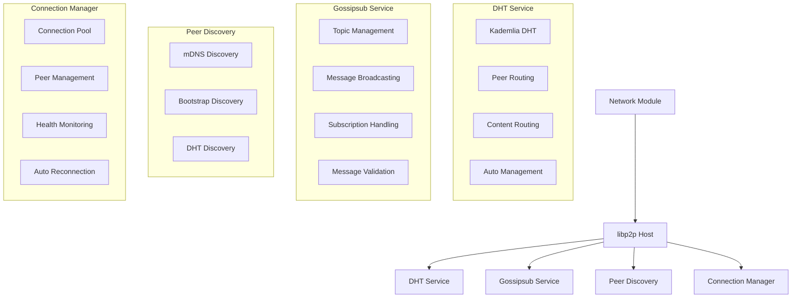

# Network Module - 基于libp2p的现代化P2P网络

## 概述

Network模块基于[libp2p](https://github.com/libp2p)官方库实现，提供了完整的P2P网络功能，包括**自动节点发现**、**DHT自动管理**、**Gossipsub消息传播**、**智能连接管理**、**私钥管理**等核心功能。

## 架构设计



## 核心功能

### 1. 自动节点发现 🎯

Network模块具备强大的自动节点发现能力，无需手动管理：

#### 发现机制

1. **mDNS发现**: 本地网络自动发现
   - 自动发现同一局域网内的其他节点
   - 零配置，即插即用
   - 适用于本地开发和测试环境

2. **Bootstrap发现**: 基于预配置节点的发现
   - 连接到预配置的bootstrap节点
   - 通过bootstrap节点发现更多节点
   - 适用于生产环境

3. **DHT发现**: 基于DHT的节点发现
   - 利用DHT网络自动发现节点
   - 去中心化，无需中心化服务器
   - 支持大规模网络

#### 发现优先级

```mermaid
graph LR
    A[启动] --> B[连接Bootstrap节点]
    B --> C[启动DHT发现]
    C --> D[启动mDNS发现]
    D --> E[持续发现新节点]
```



### 2. DHT自动管理 🎯

DHT服务完全自动化，无需手动干预：

#### 自动管理特性

- **自动引导**: 启动时自动连接到DHT网络
- **路由表管理**: 自动维护Kademlia路由表
- **节点健康检查**: 定期检查节点连通性
- **网络分区恢复**: 自动检测和恢复网络分区
- **负载均衡**: 自动平衡网络负载

#### DHT功能

- **节点发现**: 自动发现网络中的其他节点
- **内容路由**: 基于内容哈希的内容查找
- **网络拓扑**: 维护去中心化的网络拓扑
- **故障恢复**: 自动处理节点故障和网络分区

#### DHT vs 连接管理的关系

```mermaid
graph TB
    A[DHT服务] --> B[节点发现]
    A --> C[路由表维护]
    A --> D[内容路由]
    
    E[连接管理] --> F[连接池维护]
    E --> G[健康检查]
    E --> H[自动重连]
    E --> I[负载均衡]
    
    B --> J[发现节点地址]
    J --> F
    F --> K[建立TCP连接]
    K --> G
```



**为什么有了DHT还需要连接管理？**

1. **职责分工**
   - **DHT**: 负责节点发现和路由信息，不负责TCP连接维护
   - **连接管理**: 负责实际的TCP连接维护、健康检查、自动重连

2. **实际需求**
   - 应用需要知道哪些节点已连接
   - 需要处理连接断开和重连
   - 需要管理连接数量和质量
   - 需要负载均衡和故障转移

3. **自动化程度**
   - **DHT层面**: 完全自动化，无需手动干预
   - **连接层面**: 基于DHT发现结果，自动建立和维护连接

### 3. Gossipsub 消息传播

基于Gossipsub协议的高效消息传播系统：

#### 核心特性

- **高效广播**: 基于gossip的消息传播，减少网络开销
- **主题管理**: 支持多个主题的订阅和发布
- **消息验证**: 内置消息签名和验证
- **网络分区容错**: 自动处理网络分区
- **消息去重**: 自动去除重复消息

#### Gossipsub API

```go
// 广播消息
func (n *Network) BroadcastMessage(topic string, data []byte) error

// 订阅主题
func (n *Network) SubscribeToTopic(topicName string) error

// 获取主题列表
func (n *Network) ListTopics() []string

// 获取主题中的节点
func (n *Network) GetTopicPeers(topicName string) []peer.ID

// 注册消息处理器
func (n *Network) RegisterMessageHandler(topic string, handler MessageHandler)

// 获取Gossipsub实例
func (n *Network) GetPubsub() *pubsub.PubSub
```

### 4. 智能连接管理

基于DHT发现的自动化连接管理系统：

#### 与DHT的协作关系

```mermaid
graph LR
    A[DHT发现节点] --> B[获取节点地址]
    B --> C[评估连接需求]
    C --> D[建立TCP连接]
    D --> E[连接池管理]
    E --> F[健康监控]
    F --> G[自动重连]
```



#### 管理特性

- **基于DHT发现**: 利用DHT发现的节点信息建立连接
- **连接池管理**: 自动管理连接数量，避免连接过多
- **健康监控**: 定期检查连接健康状态
- **自动重连**: 连接断开时自动重连
- **负载均衡**: 智能分配连接负载
- **连接优化**: 自动优化连接质量

#### 连接管理API

```go
// 获取连接的节点
func (n *Network) GetPeers() []peer.ID

// 连接到指定节点
func (n *Network) ConnectToPeer(addr string) error

// 检查节点是否已连接
func (n *Network) IsPeerConnected(peerID peer.ID) bool

// 获取连接统计信息
func (n *Network) GetConnectionStats() map[string]interface{}
```

### 5. 私钥管理

自动化的私钥生成和管理系统：

#### 特性

- **自动生成**: 首次启动时自动生成私钥
- **文件持久化**: 支持私钥文件持久化存储
- **安全存储**: 使用PEM格式安全存储私钥
- **权限控制**: 私钥文件设置严格的权限控制

#### 私钥管理API

```go
// 保存私钥到文件
func SavePrivateKeyToFile(priv crypto.PrivKey, path string) error

// 从文件加载私钥
func loadPrivateKeyFromFile(path string) (crypto.PrivKey, error)
```

## 配置说明

### 网络配置

```yaml
network:
  # 基础配置
  port: 26656                    # 监听端口
  host: "0.0.0.0"               # 监听地址
  max_peers: 50                 # 最大连接节点数
  
  # Bootstrap节点配置
  bootstrap_peers:
    - "/ip4/192.168.1.100/tcp/26656/p2p/QmYyQSo1c1Ym7orWxLYvCrM2EmxFTANf8wXmmE7DWjhx5N"
    - "/ip4/192.168.1.101/tcp/26656/p2p/QmYyQSo1c1Ym7orWxLYvCrM2EmxFTANf8wXmmE7DWjhx5N"
  
  # 私钥配置
  private_key_path: "./private_key.pem"  # 私钥文件路径（可选）
```

### 配置字段说明

| 字段 | 类型 | 默认值 | 说明 |
|------|------|--------|------|
| `port` | int | 26656 | 网络监听端口 |
| `host` | string | "0.0.0.0" | 网络监听地址 |
| `max_peers` | int | 50 | 最大连接节点数 |
| `bootstrap_peers` | []string | [] | DHT bootstrap节点列表 |
| `private_key_path` | string | "" | 私钥文件路径，为空时自动生成 |

## 使用示例

### 1. 基础使用

```go
package main

import (
    "context"
    "log"
    "time"
    
    "github.com/govm-net/chain/config"
    "github.com/govm-net/chain/network"
    "github.com/govm-net/chain/consensus"
    "github.com/govm-net/chain/execution"
    "github.com/govm-net/chain/storage"
)

func main() {
    // 创建配置
    cfg := config.NetworkConfig{
        Port:     26656,
        Host:     "0.0.0.0",
        MaxPeers: 50,
        BootstrapPeers: []string{
            "/ip4/192.168.1.100/tcp/26656/p2p/QmYyQSo1c1Ym7orWxLYvCrM2EmxFTANf8wXmmE7DWjhx5N",
        },
    }
    
    // 创建存储实例
    storage, err := storage.New(config.StorageConfig{
        DataDir:     "./data",
        MaxSize:     1024 * 1024 * 1024,
        CacheSize:   1000,
        Compression: true,
    })
    if err != nil {
        log.Fatal(err)
    }
    
    // 创建执行引擎
    exec, err := execution.New(config.ExecutionConfig{
        MaxThreads: 8,
        BatchSize:  100,
        Timeout:    5000,
    }, storage)
    if err != nil {
        log.Fatal(err)
    }
    
    // 创建共识实例
    consensus, err := consensus.New(config.ConsensusConfig{
        Algorithm: "pbft",
        MaxFaulty: 1,
        BlockTime: 1000,
        BatchSize: 1000,
    }, exec, storage)
    if err != nil {
        log.Fatal(err)
    }
    
    // 创建网络实例
    net, err := network.New(cfg, consensus)
    if err != nil {
        log.Fatal(err)
    }
    
    // 启动网络（自动开始节点发现和DHT管理）
    if err := net.Start(); err != nil {
        log.Fatal(err)
    }
    
    // 注册消息处理器
    net.RegisterMessageHandler("blocks", func(peerID peer.ID, data []byte) error {
        log.Printf("收到区块消息: %s", string(data))
        return nil
    })
    
    // 订阅主题
    if err := net.SubscribeToTopic("blocks"); err != nil {
        log.Fatal(err)
    }
    
    // 广播消息
    if err := net.BroadcastMessage("blocks", []byte("Hello, World!")); err != nil {
        log.Fatal(err)
    }
    
    // 等待网络稳定
    time.Sleep(10 * time.Second)
    
    // 查看网络状态
    peers := net.GetPeers()
    log.Printf("当前连接节点数: %d", len(peers))
    
    // 查看连接统计信息
    stats := net.GetConnectionStats()
    log.Printf("连接统计: %+v", stats)
    
    // 等待
    select {}
}
```

### 2. 节点发现监控

```go
// 监控节点发现过程
go func() {
    ticker := time.NewTicker(30 * time.Second)
    defer ticker.Stop()
    
    for {
        select {
        case <-ticker.C:
            peers := net.GetPeers()
            stats := net.GetConnectionStats()
            
            log.Printf("网络状态:")
            log.Printf("  - 连接节点数: %d", len(peers))
            log.Printf("  - 最大节点数: %v", stats["max_peers"])
            log.Printf("  - 使用率: %.2f%%", stats["usage_percentage"])
            log.Printf("  - Bootstrap节点数: %v", stats["bootstrap_peers"])
        }
    }
}()
```

### 3. mDNS状态监控

```go
// 检查mDNS状态
if net.IsMDNSEnabled() {
    log.Println("mDNS已启用")
    
    status := net.GetMDNSStatus()
    log.Printf("mDNS状态: %+v", status)
} else {
    log.Println("mDNS未启用")
}
```

### 4. 主题管理

```go
// 列出所有主题
topics := net.ListTopics()
log.Printf("当前主题: %v", topics)

// 获取主题中的节点
for _, topic := range topics {
    peers := net.GetTopicPeers(topic)
    log.Printf("主题 %s 中的节点: %v", topic, peers)
}
```

## 自动管理特性

### 1. 节点自动发现

- **零配置**: 启动后自动开始节点发现
- **多机制**: 同时使用多种发现机制
- **智能选择**: 根据网络环境智能选择发现方式
- **持续发现**: 持续发现新节点，保持网络活跃

### 2. DHT自动管理

- **自动引导**: 启动时自动连接到DHT网络
- **路由维护**: 自动维护Kademlia路由表
- **节点健康**: 定期检查节点健康状态
- **故障恢复**: 自动处理节点故障和网络分区

### 3. 连接自动管理

- **基于DHT发现**: 利用DHT发现的节点信息自动建立连接
- **连接池**: 自动管理连接数量
- **健康检查**: 定期检查连接健康状态
- **自动重连**: 连接断开时自动重连
- **负载均衡**: 智能分配连接负载

### 4. 协作流程

```mermaid
graph TD
    A[启动] --> B[DHT引导]
    B --> C[节点发现]
    C --> D[获取节点地址]
    D --> E[评估连接需求]
    E --> F[建立连接]
    F --> G[连接池管理]
    G --> H[健康监控]
    H --> I[自动重连]
    I --> C
```



## 性能特性

### 1. 高吞吐量

- **并行处理**: 支持多线程并行处理消息
- **异步操作**: 所有网络操作都是异步的
- **连接复用**: 复用TCP连接，减少连接开销
- **消息批处理**: 支持消息批量处理

### 2. 低延迟

- **直接连接**: 节点间直接连接，无中间代理
- **消息路由**: 智能消息路由，减少网络跳数
- **连接池**: 预建立连接池，减少连接建立时间
- **缓存机制**: 多级缓存，提高响应速度

### 3. 高可用性

- **自动重连**: 连接断开时自动重连
- **故障转移**: 节点故障时自动切换到备用节点
- **负载均衡**: 智能负载均衡，避免单点故障
- **健康检查**: 定期健康检查，及时发现问题

## 监控和调试

### 1. 网络状态监控

```go
// 获取网络状态
func (n *Network) GetNetworkStats() map[string]interface{} {
    return map[string]interface{}{
        "connected_peers": len(n.GetPeers()),
        "connection_stats": n.GetConnectionStats(),
        "topics": n.ListTopics(),
        "mdns_status": n.GetMDNSStatus(),
    }
}
```

### 2. 连接统计信息

```go
// 获取连接统计信息
stats := net.GetConnectionStats()
// 返回字段:
// - current_peers: 当前连接节点数
// - max_peers: 最大节点数
// - usage_percentage: 使用率百分比
// - bootstrap_peers: bootstrap节点数量
```

### 3. mDNS状态监控

```go
// 获取mDNS状态
status := net.GetMDNSStatus()
// 返回字段:
// - enabled: 是否启用
// - service: 服务是否创建
// - service_name: 服务名称
```

## 最佳实践

### 1. 配置优化

- **合理设置连接数**: 根据网络规模设置合适的最大连接数
- **配置Bootstrap节点**: 配置足够的bootstrap节点确保网络连通性
- **私钥管理**: 生产环境建议指定私钥文件路径
- **监控网络状态**: 定期监控网络状态和性能指标

### 2. 错误处理

- **优雅降级**: 网络故障时实现优雅降级
- **重试机制**: 实现合理的重试机制
- **超时设置**: 设置合适的超时时间
- **错误日志**: 记录详细的错误日志

### 3. 性能优化

- **连接复用**: 尽可能复用连接
- **消息批处理**: 批量处理消息减少网络开销
- **缓存策略**: 实现合适的缓存策略
- **负载均衡**: 实现负载均衡避免单点瓶颈

## 故障排除

### 1. 常见问题

#### 节点发现失败
- 检查网络配置是否正确
- 确认防火墙设置
- 验证bootstrap节点地址

#### 消息丢失
- 检查消息处理器是否正确注册
- 确认主题名称是否正确
- 验证网络连通性

#### 性能问题
- 检查连接数是否过多
- 确认消息大小是否合理
- 验证网络带宽是否充足

### 2. 调试步骤

1. **检查日志**: 查看详细的错误日志
2. **验证配置**: 确认配置参数是否正确
3. **测试连通性**: 测试网络连通性
4. **监控指标**: 监控网络性能指标
5. **分析拓扑**: 分析网络拓扑结构

## 版本历史

### v2.0.0 (当前版本)
- 基于libp2p v0.43.0+重构
- **自动节点发现**: 支持多种自动发现机制
- **DHT自动管理**: 完全自动化的DHT管理
- **Gossipsub消息传播**: 高效的消息传播系统
- **智能连接管理**: 自动化的连接管理
- **私钥管理**: 自动化的私钥生成和管理
- **监控和调试**: 完整的监控和调试功能

### v1.0.0
- 基础P2P网络功能
- 简单的节点发现
- 基本的消息传递

## 贡献指南

欢迎贡献代码！请遵循以下步骤：

1. Fork项目
2. 创建功能分支
3. 提交更改
4. 推送到分支
5. 创建Pull Request

## 许可证

本项目采用MIT许可证，详见[LICENSE](LICENSE)文件。

## 参考链接

- [libp2p官方文档](https://docs.libp2p.io/)
- [go-libp2p GitHub](https://github.com/libp2p/go-libp2p)
- [go-libp2p-kad-dht](https://github.com/libp2p/go-libp2p-kad-dht)
- [go-libp2p-pubsub](https://github.com/libp2p/go-libp2p-pubsub)
